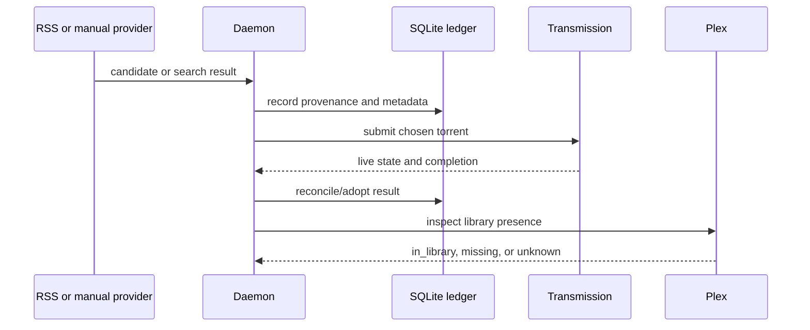

There are several entry points into Pirate Claw, but they converge on the same
big story: identify media, select a release, submit it to Transmission, retain
history, and eventually observe whether Plex has it.

## Technical view

### Movie routes

- RSS/YTS/PirateBay manual flows eventually write movie-oriented history.
- Movie Discovery helps choose candidates through Calendar, Top Movies, and Search.
- The Movies page is a completed-acquisition archive, not a live downloader view.

### TV routes

- EZTV RSS creates feed candidates.
- TV Discovery Calendar and Find help locate shows to track.
- TV Discovery Search selects season packs.
- Show detail supports episode-level selection through EZTV and PirateBay.
- Filesystem adoption can later recognize individual files from a season pack.

## In plain English

“Queued” means Pirate Claw gave Transmission work. “Completed” means
Transmission reported progress finished. “In library” means Plex was able to
confirm it. A season pack can be one download while the final library reality
is many episodes.

## The Top Movies caveat

Top Movies of Year is not simply a TMDB ranking call. V1 scrapes DVD Release
Dates, gets IMDb identities from that material, then enriches results through
TMDB. It is a useful feature with a longer dependency chain than its tab label
suggests.

## Key takeaway

Acquisition is a lifecycle, not a boolean. The UI is clearest when it shows
which step has actually happened.
