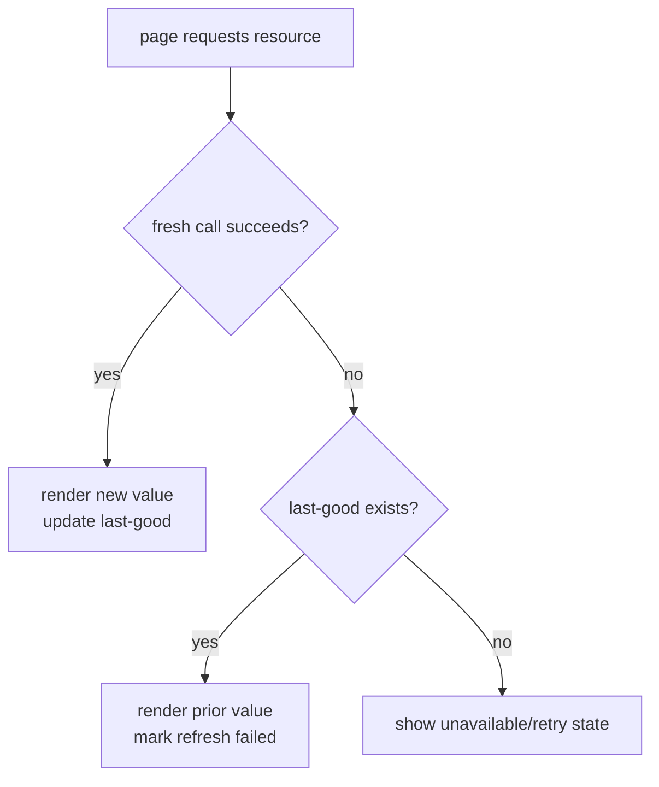

Caching is not merely a speed trick. It is an availability strategy. External services are slower and less dependable than local rendering, while Pirate Claw must remain useful when one source has a bad minute.

## Three cache patterns

**Provider caches** store TMDB and chart data so ordinary pages do not fan out externally. **Plex observation caches** store library state and sync timestamps. **Process-local last-known-good values** protect dashboard sections from being wiped by one failed background refresh.

Request failure and confirmed emptiness are different outcomes.

## Snapshot behavior can hide cold cost

Mac measurements show the contrast. A warm `/api/shows` response can fall to around a millisecond after its snapshot is ready, while the first sample took tens of milliseconds. Movie and TV calendars had a larger gap: first observed calls took seconds or hundreds of milliseconds, then warm calls returned in roughly one to twelve milliseconds.

Warm numbers do not describe discovery latency. The first request, refresh path, provider miss, and expired cache are the customer’s slow moments. Report both.

Candidates show another axis: under ten milliseconds while returning roughly 188 KB. Server speed does not erase mobile transfer and hydration cost. The dashboard now projects unused fields before shipping them to the browser.

## Freshness belongs in the contract

Every cached resource should answer when the provider was last observed, whether refresh is active, whether data is fresh/stale/absent, and whether the latest refresh failed. Today these semantics exist unevenly: Shows has fresh/stale/cold snapshot behavior, Plex has sync timestamps, and other endpoints expose a bare value.

## Avoid stampedes

Page-triggered, periodic, and post-acquisition refreshes can converge. TMDB coordination coalesces/scopes work. The general v2 pattern is single-flight caching: one caller starts refresh; others await or accept stale data rather than launching duplicates.

For v1, preserve last-good behavior, expose retry, project payloads, and measure cold paths on the M-series Mac. For v2, standardize a resource envelope such as `{ data, freshness, observedAt, refreshState, error }`.

### In plain English

A cache is yesterday’s reliable newspaper. If today’s truck is late, yesterday’s paper is better than a blank sheet—but its date must remain visible.

### Key takeaway

Fast and resilient pages need dated, honest caches. Never turn a refresh failure into an empty fact.
