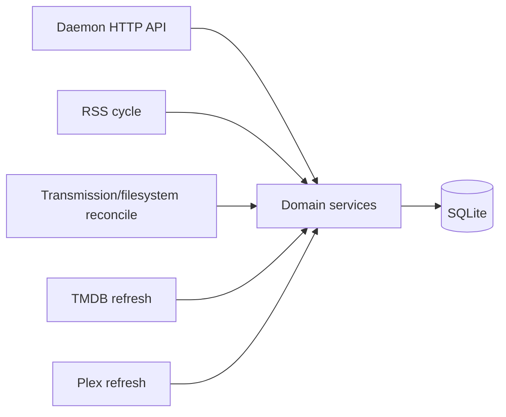

The Pirate Claw daemon is the engine room. It runs on Bun, exposes an HTTP API,
and schedules separate work for feed intake, reconciliation, TMDB refresh, and
Plex refresh.

## Technical view

The current HTTP boundary is a Bun `fetch` handler and a large manual
path-and-method dispatcher. That is a real backend API today. Hono would be a
future reorganization of that boundary, not the moment Pirate Claw “gets a
backend.”

Intervals come from runtime configuration. Source code describes scheduling
shape and safety guards; only a live config capture can state the actual
cadence on a given host.

## In plain English

The daemon keeps working even when no browser tab is open. It watches for new
releases, checks whether downloads finished, warms metadata, and asks Plex what
it can prove. The dashboard is a window onto that ongoing work.

## V1 strengths

- Background responsibilities are separate rather than one giant forever-loop.
- Health tracks active cycles and recent outcomes.
- Long-running work can be represented without making every page request wait.

## V2 thought, not a v1 mandate

Give each recurring job a first-class event record: start, inputs, work done,
duration, affected media identities, result, and retry decision. That makes
debugging causal instead of archaeological.

## Key takeaway

The daemon owns progress. The web UI should reflect it without becoming the
place where background logic lives.
