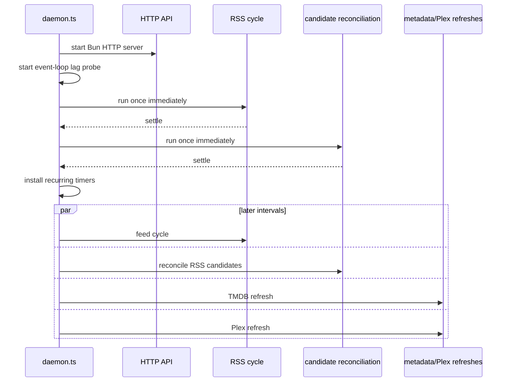

The daemon is not a queue runner with a web server bolted on. It is the long-lived owner of the API, feed cycles, candidate reconciliation, metadata refresh, Plex refresh, runtime health, and the shared dependencies those jobs use. The interesting part is not that timers exist. It is which work may overlap, which work must not, and what happened when those choices were wrong.

## Startup is ordered work

Starting the server first matters: the UI can inspect health while the first expensive cycle runs. Running intake and reconciliation immediately matters too: a restart does not wait an entire interval before becoming useful.

## The locks encode policy

RSS intake and RSS candidate reconciliation share one busy gate. If either is active when the other timer fires, the second cycle is skipped. They both walk and mutate the RSS-oriented acquisition model, so overlapping them would trade a little freshness for duplicated pressure and harder reasoning.

TMDB and Plex refreshes each have their own in-flight guard. They can overlap RSS work and each other. `cli.ts` adds coordination around TMDB scopes because periodic refresh, page-triggered refresh, and post-intake enrichment can otherwise ask for the same work at once.

This is not a general-purpose scheduler. It is a small set of promises expressed as booleans and timers:

- never run feed intake and candidate reconciliation together;
- never launch a duplicate TMDB refresh of the same coordinated work;
- never launch a duplicate Plex refresh;
- allow unrelated provider work to overlap;
- on shutdown, stop admitting scheduled work and wait for active work to settle.

Those promises should be written down because changing a timer without understanding its lock changes system behavior.

## The 30-second lesson

Reconciliation once ran every 30 seconds and rewrote every tracked candidate. On constrained NAS hardware, that “small background job” began overlapping with the rest of the runtime. Nominal 15-minute feed polls slipped to roughly 30–65 minutes. Event-loop lag warnings reached tens of seconds.

The current default is 240 seconds. That is not a magic optimum; it is a scar made into a safer default. Reconciliation is eventually consistent housekeeping. Running it four times a minute does not make completed media four times more correct, but it can starve the work that discovers new media.

> **Mentor's note:** Timer frequency is a load multiplier. Before shortening an interval, multiply the job’s worst-case work by the number of rows it scans, then consider what else may be active on the same event loop and disk.

## Scheduled reconciliation is not adoption

Two mechanisms are easy to conflate:

1. The scheduled reconcile cycle updates RSS `candidate_state` from Transmission observations.
2. TV adoption inspects Transmission and the filesystem to recognize episodes that arrived outside the normal ledger path.

Adoption is triggered as part of episode-state work when a show’s adoption record is stale. It is not the ordinary recurring daemon reconcile timer. Drawing both as one “reconciler worker” hides different triggers, tables, and failure behavior.

## What cycle artifacts tell us—and what they do not

Runtime artifacts capture whether a cycle started, how long it took, and whether it succeeded. They are useful answers to “is the daemon alive?” and “did the scheduled job complete?” They do not form a causal audit trail. They do not enumerate provider calls, identities changed, retry decisions, or rows written.

That gap is acceptable for shipping v1 if logs and durable failure stores make incidents diagnosable. In v2, background jobs deserve a run record with structured counters and child operations, not just a timing artifact.

## V1 discipline and v2 opportunity

For v1, protect the current lock semantics, keep defaults conservative, and instrument duration plus skipped-cycle reasons. Do not introduce a job framework solely for architectural neatness before November.

For v2, a small scheduler abstraction could give each job a name, concurrency key, cadence, last success, next run, cancellation signal, and structured result. The goal is not enterprise ceremony. The goal is to answer “what is running, why, and what did it change?” without reading timer code.

### In plain English

The daemon has several alarm clocks. Some chores are forbidden from running together because they rummage through the same paperwork. Other chores may overlap. An old alarm rang too often and made the whole office late, so its cadence was deliberately slowed.

### Key takeaway

The daemon’s clocks and locks are architecture, not implementation trivia. They encode hard-won limits on concurrency and background pressure.
