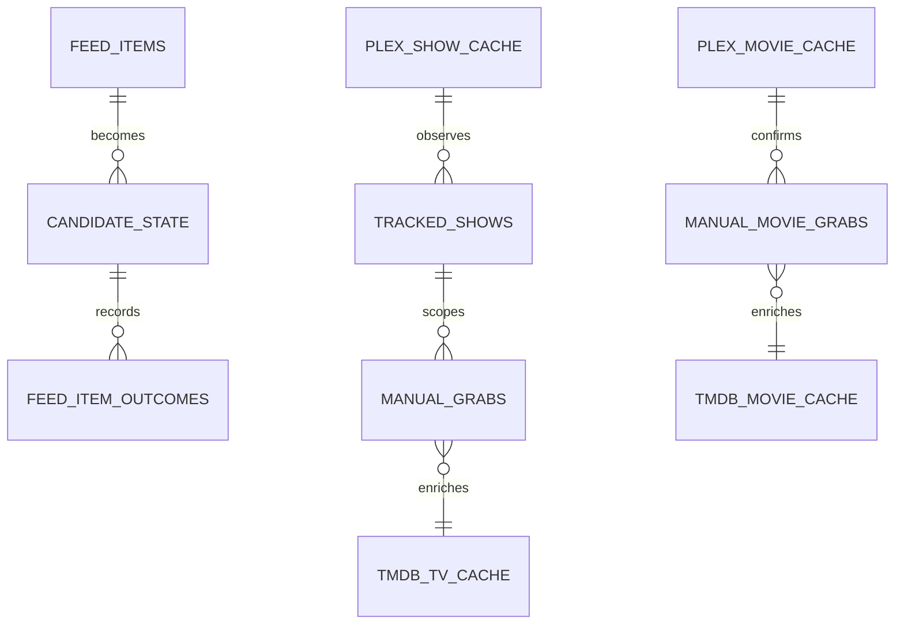

SQLite is Pirate Claw's memory, but it is not the only authority in the system.
Its ledgers record what Pirate Claw attempted and observed. Transmission knows
the live torrent. Plex supplies library-presence evidence. Providers supply
metadata that can change, fail, or be cached.

## Technical view

The RSS path uses feed-oriented tables such as `feed_items`, `candidate_state`,
and `feed_item_outcomes`. TV manual/adopted grabs and movie manual/adopted
grabs have distinct ledgers because their provenance and identity shapes differ.
That split is intentional in v1, even if v2 could express both through shared
domain concepts.

## In plain English

Pirate Claw keeps a diary, not a magic answer book. The diary says “we queued
this,” “this torrent completed,” or “we saw this file.” Plex answers a different
question: “can I see this in the library right now?”

## Easy win

Document each displayed field with its owner: ledger, TMDB cache, Plex cache,
Transmission, or filename parsing. This removes a shocking amount of mystery
when a poster has no description or a title is marked unknown.

## Risky v2 work

Merging ledgers, changing identity keys, or rewriting ownership semantics can
destroy useful provenance. Those are migration projects, not cleanup chores.

## Key takeaway

Do not ask SQLite to prove Plex ownership, and do not ask Plex to explain every
historical acquisition decision.
