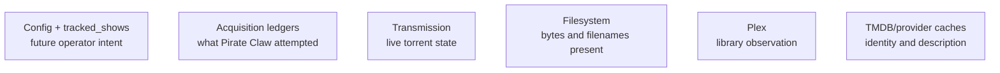

“What is the source of truth?” sounds disciplined. In Pirate Claw it is incomplete. The correct question is: **source of truth for which fact, at what time, and with what confidence?**

## Six authorities, six jobs

None can replace the others without losing meaning.

| Displayed fact | Primary owner | Common trap |
|---|---|---|
| Show is tracked | `tracked_shows` and current config | Reconstructing intent from old candidates resurrects untracked shows. |
| Pirate Claw grabbed a release | RSS or manual acquisition ledger | Plex presence does not prove Pirate Claw acquired it. |
| Torrent is 63% complete | Transmission | A cached ledger percentage is an observation, not live state. |
| Movie title, poster, overview, language | TMDB cache | Missing enrichment is not missing acquisition. |
| Resolution and codec | Release-name parsing/provider result | These may be unknown because naming quality varies. |
| Episode file exists | Filesystem/adoption evidence | Filename matching can be uncertain. |
| Media is in the library | Plex GUID/season observation | A failed or stale sync must remain `unknown`. |

## Intent is not history

Early TV behavior blurred “a show once produced a candidate” with “the owner currently tracks this show.” That creates resurrection: remove a show, restart, and historical rows quietly put it back. The dedicated `tracked_shows` ledger exists to prevent history from rewriting current intent.

The same distinction appears in deletion. A deleted acquisition remains historical evidence, but it should no longer count as owned. A later active re-grab should count again. Product semantics live in those transitions; they cannot be reconstructed reliably from one boolean.

## Observation is timestamped

A Plex cache row means “Plex said this at the recorded sync,” not “this is eternally true.” A TMDB overview means “this provider returned this description when refreshed.” A Transmission snapshot means “the torrent was in this state during reconciliation.”

Every cache-backed claim should conceptually carry `observedAt`, even if the UI does not print it on every card. When freshness is unknown, the interface should soften certainty rather than fill the gap with a default.

## Provenance is product data

Pirate Claw distinguishes RSS acquisitions, explicit manual grabs, Transmission adoption, filesystem adoption, and Plex catalog observations. Those labels explain why records have different fields and confidence. Removing them would make the schema prettier and support harder.

The Movies archive combines completed RSS candidates and completed manual movie grabs. It intentionally excludes movies merely discovered through Plex or the filesystem because the page means “Pirate Claw’s haul,” not “everything you own.” That product definition is expressed in a projection.

## A practical debugging method

When a card is wrong:

1. Name the exact disputed field—do not say “the movie is wrong.”
2. Identify its authority from the table above.
3. Check the authority’s freshness or live state.
4. Check the join identity used to project it onto the card.
5. Only then inspect component rendering.

If a movie lacks an overview but has the correct torrent, inspect TMDB identity/cache joins, not Transmission. If a show is marked missing while Plex is down, inspect whether unknown was coerced to false. If resolution is absent, inspect the release title/provider payload before assuming enrichment failed.

## What v2 should improve

V2 should not chase one global truth table. It should make plural truths explicit through types such as `OperatorIntent`, `AcquisitionAttempt`, `TorrentObservation`, `FileObservation`, `LibraryObservation`, and `MetadataSnapshot`. Each can state source, timestamp, confidence, and qualified identity.

### In plain English

Pirate Claw keeps several notebooks: standing instructions, orders it placed, delivery trucks, and what the librarian found. Combining them would not make the answers truer; it would erase why they differ.

### Key takeaway

Never ask for “the” source of truth without naming the fact. Correctness comes from preserving intent, history, live state, and observation as different things.
