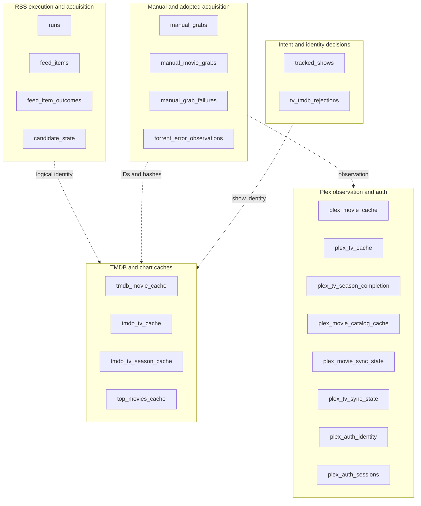

Pirate Claw’s SQLite file contains at least twenty-two tables. That is not automatically evidence of failure. It reflects distinct workflows: RSS processing, manual acquisition, durable failures, provider caches, Plex synchronization, auth, adoption, and operator intent.

The misleading diagram is one clean ER model with arrows that look like enforced foreign keys. Most important joins are logical: normalized names, slugs, torrent hashes, or qualified provider IDs. SQLite does not guarantee all the relationships the product relies on.

## Table families

The dashed lines are intentional: application-level joins, not guaranteed parents.

## RSS tables answer process questions

`runs` records execution. `feed_items` records provider sightings. `feed_item_outcomes` records why a sighting did or did not produce work. `candidate_state` tracks the durable lifecycle of an accepted RSS identity.

These shapes assume feed provenance: run, feed, GUID/link, rule, normalized title. A manual grab has none of that. Forcing it into `candidate_state` would require invented feed identities. Separate manual ledgers avoided corrupting the meaning of RSS data.

## Manual ledgers answer operator-choice questions

`manual_grabs` is TV-shaped: show identity, season/episode context, release choice, torrent identity, and adoption provenance. `manual_movie_grabs` is movie-shaped around TMDB identity. Failed submissions live separately because an attempt Transmission rejected must not appear as an acquisition.

Season packs make the TV shape especially useful. One selected torrent can later resolve into multiple episode observations while preserving the original choice.

## Caches answer dated external questions

TMDB tables avoid repeating expensive metadata calls and provide stable enrichment joins. Plex tables store observations and separate sync timestamps. Auth tables support connection lifecycle, not media truth. The movie catalog cache enables ownership reconciliation without turning every render into a live Plex crawl.

## Additive migrations are a v1 strength

Schema code creates missing tables, adds absent columns, and builds indexes. That makes upgrades safer for long-lived installations. The trade is historical irregularity: old rows may lack later fields and docs can drift.

The right November work is a verified schema inventory and migration tests against old fixtures—not a grand normalization project.

## A cleaner v2 vocabulary

V2 could center `MediaIdentity`, `ReleaseCandidate`, `AcquisitionAttempt`, `AcquisitionEvent`, and `LibraryObservation`. It can still use SQLite. The improvement is conceptual cohesion, not a larger database.

### In plain English

The database is a filing cabinet with drawers for different jobs. Some folders refer to the same movie by a TMDB number or torrent hash, but a metal bar does not physically lock every folder together. The application must join them correctly.

### Key takeaway

Separate ledgers preserve honest provenance. Improve their contracts and documentation before trying to merge them.
