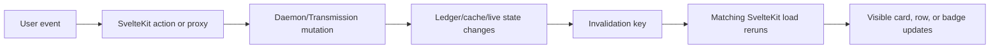

An event map is the missing bridge between a button and the data it changes.
It is where product behavior, daemon work, and SvelteKit invalidation meet.

## Current pattern



| Event | What actually changes | Best affected UI resources |
| --- | --- | --- |
| Pause/resume/remove torrent | Transmission state and dashboard summary | Torrent list + dashboard content |
| Delete movie | Movie archive/history; possibly ownership presentation | Movies archive + related dashboard/discovery views |
| Track show | TV config and tracked-show ledger | TV Discovery + Shows list |
| Grab episode | Manual TV ledger + Transmission | Show detail + live torrents |
| Grab movie | Movie ledger + Transmission | Movie Discovery + live torrents/archive |
| Plex sync | Cached library observations | Movies, Shows, discovery ownership indicators |
| Save config | Runtime/provider configuration | Config and any route dependent on the changed capability |

## `invalidateAll()` versus named invalidation

V1 already has a good targeted example: Dashboard uses separate torrent and
content keys rather than refreshing the whole app on every progress update.
That avoids refetching unrelated layout data for a pause or resume action.

But a named invalidation is not magic. It reruns the full SvelteKit `load`
function that declared that key. If one load groups four daemon calls, all four
run. That is still much better than `invalidateAll()` when the group is truly a
coherent resource, but it is not per-field reactivity.

Movie deletion is the teaching example: its current broad refresh is safe, but
likely wider than the mutation requires. The v2 investigation question is not
“can we replace every broad invalidation?” It is “what resources actually
became stale?”

## A v2-friendly vocabulary

Use domain effects, not SvelteKit keys, at the daemon boundary:

```text
deleteMovie → movies.archive, dashboard.content, movie.ownership
grabEpisode → show.episode-status, transmission.torrents
plexSync    → plex.movie-observations, plex.show-observations
```

The web layer can map those effects to its own invalidation keys. That keeps the
daemon free of framework-specific knowledge.

## Key takeaway

`invalidateAll()` is appropriate for restart, session, or unknown global state.
Local mutations deserve an explicit statement of what they made stale.
