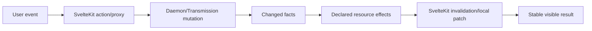

The missing document in many web apps is not an endpoint list. It is an **effect map**: when the user does this, what truth changes, which projections become stale, and what work should run next?

## From gesture to visible consequence



V1 often jumps from mutation directly to `invalidateAll()`. That is safe when effects are unknown and expensive when they are local.

## Current event map

| Event | Facts changed | Smallest useful refresh |
|---|---|---|
| Pause/resume torrent | live Transmission state | torrent tier; perhaps related content summary |
| Remove torrent/files | Transmission plus possible candidate/manual disposition | torrent and content tiers |
| Grab movie | manual movie ledger + Transmission | local movie state, torrents, later archive |
| Grab episode/pack | manual TV ledger + Transmission | affected season and torrents |
| Delete archive movie | movie acquisition disposition/archive | Movies archive; ownership projections if shown elsewhere |
| Track show | config + tracked ledger + scoped feed replay | TV Discovery and Shows resources |
| Refresh one show’s Plex state | Plex observation for one identity | show detail or Shows collection |
| Full Plex sync | many ownership observations | broad movie/show ownership resources |
| Restart daemon | potentially every daemon-backed resource | `invalidateAll()` |

## What `invalidate(key)` actually does

A SvelteKit load function declares dependencies with `depends(key)`. Calling `invalidate(key)` reruns every load function that declared that key. It does not update one field inside a load.

If one load declares `app:config` and makes six daemon calls, invalidating that key repeats all six. Named invalidation is valuable only when load functions are already grouped by coherent resource/volatility.

The Dashboard demonstrates the model: torrents and slower content live in separate load units with separate keys. Show Detail’s manual grab is even better: it disables broad form invalidation and reloads only the selected season.

## Broad refreshes still worth fixing

- Transmission Failures can trigger two complete invalidations for one retry/dismiss.
- Movies deletion reloads the shared layout because the route lacks a page key.
- Shows bulk Plex refresh reloads the whole app rather than `app:shows`.
- Movie Discovery patches local grab state but enhanced form behavior may still reload the page.
- Config Plex sync cards refresh broadly after already receiving definitive streamed completion.

These are pre-November candidates because their intended effects are already understood. Change one at a time and assert exact daemon call counts in tests.

## Local patch versus server refresh

Local optimistic updates are appropriate when the mutation response contains the authoritative new state. “Transmission accepted this TMDB ID” can mark a discovery card grabbed immediately. A background Plex sync touching hundreds of records should not be faked locally.

The best pattern is:

1. mutation returns the changed object and semantic effects;
2. component patches immediate local state;
3. affected shared resources invalidate in the background;
4. old visible data remains if refresh fails, with an error indicator.

## V2 should return domain effects

The daemon should not know SvelteKit keys. It can return resource effects such as:

```text
grabMovie  → acquisition.movie:123, transmission.torrents, movies.archive
grabPack   → show:slug:season:2, transmission.torrents
plexSync   → plex.movie-observations, plex.show-observations
```

The web maps effects to its cache/invalidation system. That keeps a future native Mac shell or CLI from inheriting framework-specific concepts.

### In plain English

After changing one book, you should update that catalog card—not recount every shelf, recheck the building alarm, and call the electricity company. Recount everything only when the whole library restarted.

### Key takeaway

Precise updates start with explicit mutation effects and resource-shaped loads. `invalidateAll()` is a symptom; unclear resource ownership is the cause.
