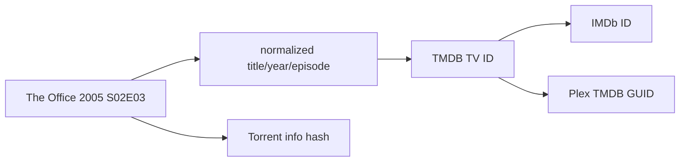

The hardest part of Pirate Claw is not downloading. It is deciding that five imperfect references point to the same work: a feed title, a TMDB record, an IMDb ID, a torrent release, and a Plex item.

## One title, many identities

Each arrow is a claim. Some come directly from a provider; some are parsed; some are search matches; some are pinned by the operator. Treating all arrows as equally certain is how the wrong remake gets tracked forever.

## Stable IDs are stronger than names

Titles vary by punctuation, translation, year suffixes, and release-group clutter. Two shows can share a name. TMDB IDs and Plex provider GUIDs are stronger join keys. Torrent hashes identify a release, not a movie or show; they solve a different identity problem.

TV tracking supports pinned TMDB identity. Same-title collision logic compares IDs and can disambiguate stored names by year or ID. Older rules without pins require a cautious lookup, and inability to resolve should prefer “already tracked” over creating a duplicate entry.

## Rejections are knowledge

When a proposed TMDB match is wrong, remembering the rejection prevents the same bad candidate from returning. `tv_tmdb_rejections` is small but important: negative identity decisions are durable product knowledge.

“Unverified” is also real. A likely match may enrich provisionally while still requiring confirmation before becoming a trusted pin.

## Filename parsing has limits

Release names are rich but inconsistent. Season/episode markers, year, resolution, codec, source, and language may be present, malformed, or absent. Parsing should return partial evidence rather than force a complete object.

That explains mixed movie-card data. Resolution and codec depend heavily on release naming/provider structure. Overview and language depend on metadata identity. A missing badge is often honest uncertainty, not a rendering bug.

## Provider replacement starts here

A v2 model should store qualified IDs—`tmdb:123`, `tvdb:456`, `imdb:tt789`—plus the source, timestamp, and confidence of each crosswalk. Existing TMDB pins and history then remain valid while another provider is introduced gradually.

## The v1 rule

Before November, protect identity behavior. Test remakes, punctuation variants, pins, rejected candidates, manual movie confirmation, and Plex GUID joins. Do not “simplify” matching because a title-only happy path looks convincing.

### In plain English

Names are labels written in pencil. Provider IDs are serial numbers. Torrent hashes are shipping labels. Plex GUIDs are library catalog numbers. Pirate Claw connects them without claiming certainty it does not have.

### Key takeaway

Identity confidence is domain data. Prefer stable qualified IDs, remember human corrections, and let uncertainty stay visible.
