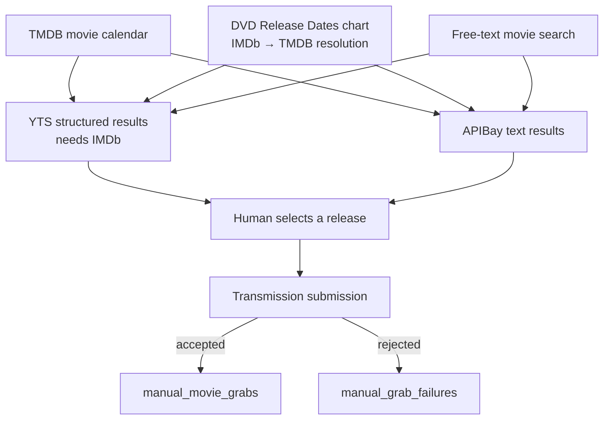

The manual paths converge on a human choosing a particular release. They do not begin with equivalent information, and they do not use the RSS state machine. Saying “all paths are first class” should mean each produces a truthful, supportable acquisition record—not that every path is mechanically identical.

## Movies: three discovery surfaces, one chosen-release endpoint

Movie Calendar, Top Movies of the Year, and Search help the user locate a movie and inspect torrents. Calendar and Top Movies are discovery surfaces; after a release is selected, they use the same manual movie-grab operation as Search.

The ordering matters. Manual grabs submit to Transmission first. A normal manual-grab ledger row means Transmission accepted the request; failed submissions go to a durable failure table. The earlier guide claimed provenance was recorded before submission. That was tidy and wrong.

YTS offers structured qualities and generally cleaner release metadata, but its lookup depends on resolving the movie to an IMDb ID. APIBay can search title and year directly. Free-text Search runs both sources and lets one still help if the other is unavailable.

Top Movies has the longest discovery chain: scrape an external HTML page, extract rank/title/format/IMDb identity, resolve that identity through TMDB, merge ownership state, and cache by year. It deserves explicit failure states because “the chart is empty” could mean the scraper drifted, TMDB failed, or there truly were no results.

## TV: tracking and grabbing are separate decisions

TV Discovery primarily answers “what show should Pirate Claw track?” Calendar and Search add a pinned show identity to the watchlist. That does not immediately choose a torrent; it changes future RSS intent and triggers scoped history replay.

The show-detail page answers a later question: “which release should I grab for this missing episode or season?” EZTV needs a TMDB-to-IMDb crosswalk. APIBay can search text. Combined search starts the IMDb lookup and text search concurrently so EZTV’s identity dependency does not hold the entire experience hostage.

Manual TV selection intentionally bypasses automatic RSS quality policy. The human has already reviewed a concrete release. Reapplying broad automation rules after that choice would turn a manual escape hatch into another opaque rejection point.

## What “first class” should require

Every path should preserve:

| Fact | Why it matters |
|---|---|
| Canonical media identity | Lets Plex and TMDB observations join safely. |
| Raw release title | Preserves what the user actually selected. |
| Provider/source | Explains where the candidate came from. |
| Magnet/hash or Transmission identity | Connects intent to live/completed download state. |
| Resolution and codec when known | Useful presentation and review data, never guaranteed. |
| Timestamp and disposition | Supports history and recovery. |
| Failure separately from success | Prevents “attempted” from becoming “acquired.” |

Overview, poster, language, and rating are presentation metadata. The robust design records the provider identity and joins enrichment; it does not require every acquisition row to snapshot every TMDB field. The recent manual-movie overview fix closed a path-specific enrichment gap while retaining that model.

## The asymmetry is healthy

RSS has feed provenance and policy decisions. Manual grabs have explicit human intent. Adopted files have observational provenance. Forcing all three into one row shape would require fake values: a manual grab has no real feed run, and an adopted file has no real enqueue event. Separate ledgers are not automatically duplication; they preserve honesty.

V2 can unify them under an `Acquisition` domain model with typed provenance variants. That is different from flattening them into one table today.

### In plain English

Calendar, charts, and search are different aisles in the same store. Once you pick a specific box, they use the same checkout. RSS is a standing grocery order, and adoption is finding an item already in your pantry. They all result in food at home, but the receipts should not pretend the journeys were identical.

### Key takeaway

Judge acquisition paths by whether they preserve truthful identity, provenance, success, and failure—not by whether they share the same functions or tables.
