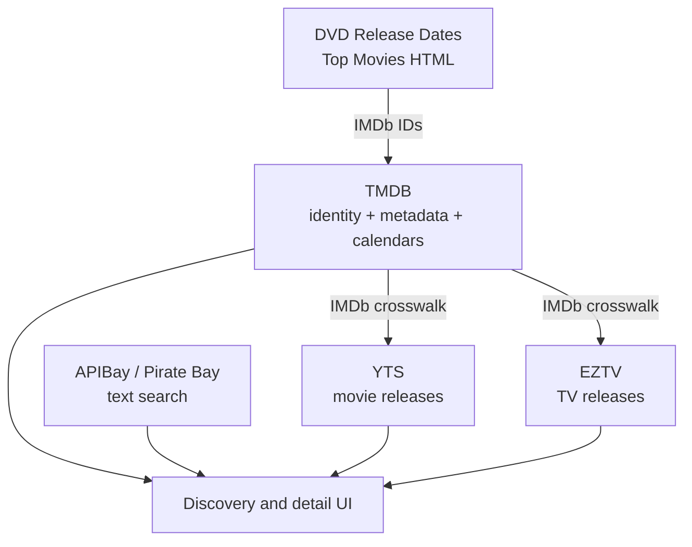

Pirate Claw talks to several external services, but they do not provide interchangeable lists of torrents. Each has different identity requirements, fields, failure modes, and legal posture. A provider layer has to model those capabilities, not merely wrap `fetch`.

## The dependency graph

TMDB supplies calendars, canonical movie/show identity, episode maps, release dates, posters, backdrops, language, ratings, overviews, and the IMDb crosswalk required by structured YTS and EZTV lookups. That makes it part of the acquisition path, not a coat of paint.

APIBay is more independent because it can search text and category. The freedom comes with weaker structure and an unofficial mirror. DVD Release Dates is an HTML scraper; a markup change can break it without an API version changing.

## What happens without a TMDB key

Degradation is uneven:

| Capability | Without TMDB |
|---|---|
| RSS ingestion and filename policy | Largely continues |
| Transmission control | Continues |
| APIBay text search | Can continue |
| Calendar discovery | Unavailable |
| Rich posters, overviews, ratings, language | Missing or stale cache only |
| YTS structured movie lookup | Impaired because IMDb crosswalk is missing |
| EZTV structured TV lookup | Impaired for the same reason |
| Canonical manual movie identity/history | Cannot be fully trusted |
| Episode maps and completeness reasoning | Impaired |

This needs an explicit TMDB-free acceptance test before shipping, not just a reasoned table. The app should either present a coherent reduced mode or tell the owner that a key is required for the intended experience.

## Provider clients already know useful distinctions

The clients use timeouts and parse diagnostics and can distinguish “no results” from “provider failed.” Preserve that distinction all the way to the UI. An empty list invites the user to change the search. A provider outage invites retry or fallback.

Endpoints are currently hardcoded in provider modules. That is serviceable for v1 but brittle for a paid product, especially for mirrors. V2 should inject base URLs and expose capability/health metadata. A torrent provider adapter might declare:

- media types supported;
- required identity (`imdb`, text, or none);
- structured qualities available;
- pagination behavior;
- retry posture;
- legal/licensing notes;
- current health and last successful request.

## Replacing TMDB is a migration

The code encodes TMDB in table names, route names, cache keys, manual movie rows, tracked-show pins, DTOs, and UI assumptions. Replacing it with TheTVDB plus Fanart.tv is not a client swap. It requires an identity crosswalk and a plan for existing history.

A provider-neutral v2 model would store qualified IDs such as `tmdb:123`, `tvdb:456`, and `imdb:tt...`, plus the source and confidence of each relationship. Artwork would be a separate capability from identity. That allows Fanart.tv to enrich presentation without becoming the canonical show database.

For v1, do not attempt this migration before November. Document the dependency, test key absence, and ensure the commercial license posture is understood.

### In plain English

TMDB is both the address book and the encyclopedia. YTS and EZTV often need an address from that book before they can search. Pirate Bay can search by a handwritten name, but the result is less structured. Swapping encyclopedias means translating all the saved addresses, not changing one URL.

### Key takeaway

Provider abstractions must represent identity and capability, not just HTTP calls. TMDB is embedded infrastructure in v1, so replacement belongs to a deliberate v2 migration.
