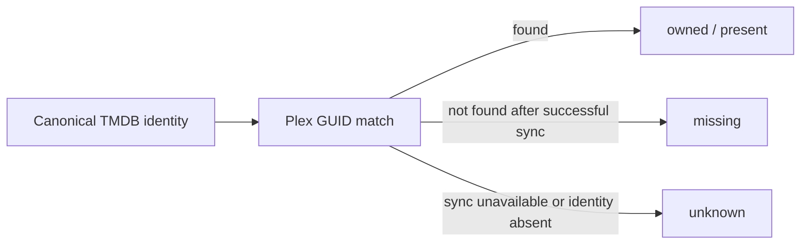

For the product Pirate Claw is becoming, Plex is a reasonable customer assumption. That makes Plex the strongest practical witness for the question users care about: “is this movie or episode in my library?” The word witness is deliberate. Plex reports what it currently sees; it does not own Pirate Claw’s history or intentions.

## What Plex can prove

Plex can expose library items, provider GUIDs, seasons, episodes, and availability as observed by its scanner. A TMDB GUID match is much stronger than a title comparison. For TV completeness, season-by-season aired episode counts are more honest than comparing one total that includes future episodes.

The `unknown` branch matters. A failed Plex request, absent GUID enrichment, or stale cache is not evidence that media is missing. Collapsing unknown into false produces duplicate grabs and erodes trust.

## What Plex cannot prove

Plex does not tell us which provider supplied a torrent, whether Pirate Claw selected it automatically or manually, which release was rejected first, or why a user deleted it. Those are acquisition-history questions. Even if the current Plex library contains the result, provenance belongs in Pirate Claw’s ledgers.

Plex also cannot prove causation. A movie appearing after August 27 can be counted as a library addition. Attributing every addition to Pirate Claw is an operator assertion unless the acquisition trail joins cleanly to it.

## Cache truth is dated truth

Many screens do not query Plex live on every render. They use movie and TV caches plus explicit sync state. That is the right performance choice, but the UI must expose freshness and avoid definitive language when the last successful sync is unknown.

The movie catalog cache is deliberately not a tiny TTL cache; it refreshes through bootstrap or explicit synchronization. That makes repeated page loads cheap and means stale data can persist until refresh. The product contract should say so plainly.

## Why title matching is a fallback

Titles have remakes, translations, punctuation variants, and aliases. “The Office” without country/year/provider identity is not a key. When provider GUIDs are available, use them. When only title evidence exists, record the lower confidence rather than silently upgrading it.

The same rule applies to adoption. A plausible directory name may be enough to offer a match for review, not enough to rewrite canonical identity.

## Plex dependence and product positioning

If Plex is a supported prerequisite rather than an optional integration, Pirate Claw can simplify its promise: it manages acquisition into a Plex-centered personal library. That is sharper than claiming to support every media server while only one receives deep verification.

The trade is lock-in. A future Jellyfin or Emby adapter would need a provider-neutral `LibraryWitness` contract. V1 does not need that abstraction solely to appear portable. It needs clear errors, reliable auth, sync freshness, and correct unknown semantics.

### In plain English

Plex is the librarian checking the shelves. If the librarian can point to the exact edition, that is strong proof it is present. If the librarian is off duty, the answer is “we don’t know,” not “the book is missing.” The librarian still cannot tell us who ordered the book or why.

### Key takeaway

Use Plex as present-library evidence, not as acquisition history. Always keep stale or unavailable observation distinct from a confirmed miss.
