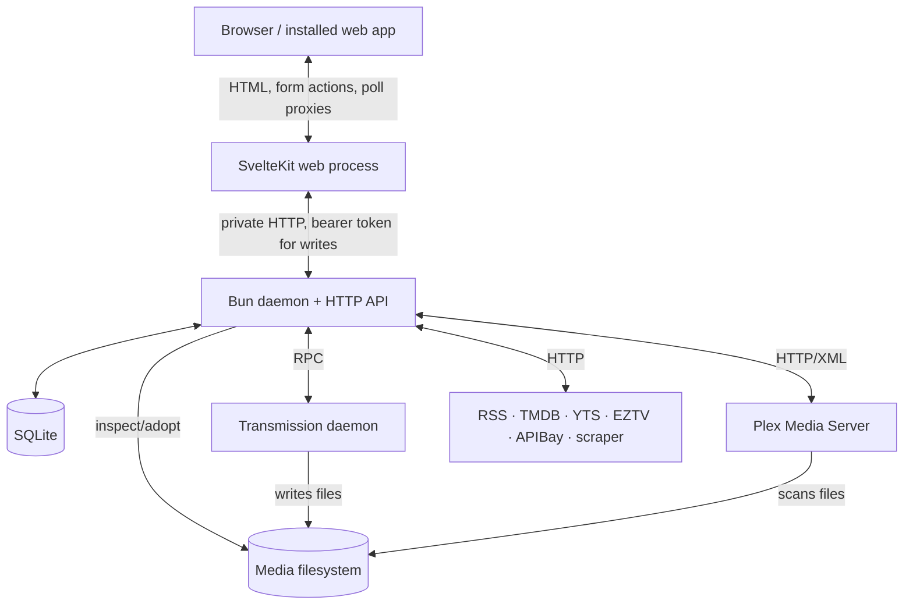

Pirate Claw is easiest to misunderstand when we call it “the app.” It is several long-lived systems cooperating across boundaries that can fail independently. The browser can be healthy while the daemon is wedged. The daemon can be healthy while Transmission rejects RPC calls. Plex can be online while its cached library picture is old.

## The runtime map

The browser never needs a TMDB key, Plex token, or daemon write token. SvelteKit is both a renderer and a server-side boundary: it authenticates the human session, runs page loads and form actions, and calls the daemon on the user’s behalf. The daemon owns domain behavior. Transmission downloads. Plex indexes and serves media. SQLite remembers what Pirate Claw decided or observed.

That separation is a strength. It keeps secrets out of browser JavaScript and lets the web UI fail without stopping feed intake. It also creates a debugging discipline: every cross-process call needs a timeout, an intelligible error, and enough correlation to trace a gesture across the boundary.

## Follow ownership, not control flow

Code encourages us to follow calls: component → form action → endpoint → store. Operators need a different map: who owns the answer?

| Question | Best authority | Important qualification |
|---|---|---|
| What did the user ask Pirate Claw to acquire? | Pirate Claw ledgers | RSS and manual paths use different ledgers. |
| Is the torrent actively downloading? | Transmission | Its state is live but says nothing about Plex matching. |
| Is the movie or episode in the library? | Plex | Cached observations can be stale or unknown. |
| What is the canonical title or episode map? | TMDB cache/provider | Provider identity can be wrong or unavailable. |
| What file appeared on disk? | Filesystem | A filename is evidence, not guaranteed identity. |
| What is tracked for future TV matching? | `tracked_shows` plus config | Historical candidates must not resurrect intent. |

The phrase “single source of truth” is dangerous here. There is no honest single source for all six questions. V1 works because it increasingly preserves the distinctions instead of flattening them.

## Boundaries that are real today

The daemon exposes a large hand-written HTTP dispatcher. That is already a backend API, even though it does not use Hono or another framework. The web process has typed local interfaces, but runtime payload validation is inconsistent and the two sides can drift. Transmission’s boundary is JSON-RPC with the extra wrinkle that an HTTP 200 can still contain a logical RPC failure. Plex returns its own models and has separate authentication state. Provider clients each carry different search and identity semantics.

The filesystem boundary deserves special respect. Transmission may say a torrent is complete before Plex has scanned it. A season pack may contain samples, subtitles, or oddly named episodes. Adoption therefore cannot be a blind “file exists, mark complete” operation.

## Why the topology should not be collapsed for v1

It is tempting to remove a hop: let the browser call the daemon directly, embed Transmission behavior into Pirate Claw, or make SQLite the final ownership database. Each shortcut erases a useful safety boundary.

- Browser-to-daemon calls would expose service topology and complicate session security.
- Treating the downloader as a library confuses “bytes arrived” with “media exists.”
- Treating Pirate Claw history as Plex truth makes deletions and external imports lie.
- Treating Plex as acquisition history loses how and why a release was chosen.

For November, the right work is to make these seams dependable and observable. V2 can improve the contracts without pretending the systems are one thing.

### In plain English

Think of a small restaurant. The web UI is the waiter, the daemon is the kitchen manager, Transmission is the cook, Plex is the person checking that the plated meal reached the pass, and SQLite is the order book. Asking the order book whether the meal tastes right is the wrong question—even if the order book is perfectly accurate.

### Key takeaway

Pirate Claw is an orchestrator. Debug it and redesign it by respecting the systems it coordinates and the different truths they own.
