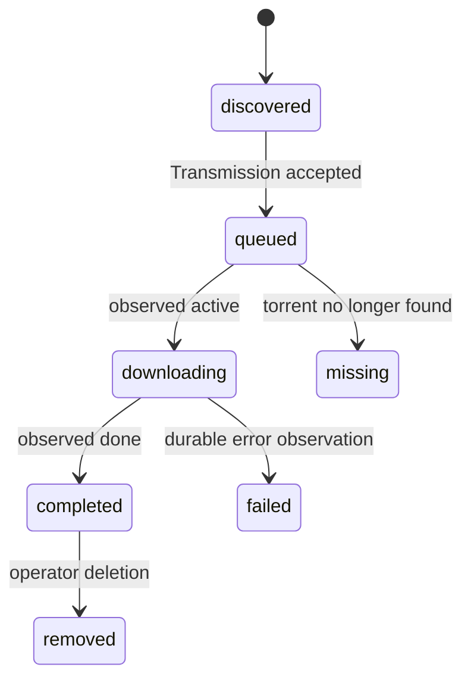

Acquisition systems have two uncomfortable realities: work finishes later than the request that started it, and media can arrive outside the expected path. Reconciliation handles the first. Adoption handles the second. They are related, but collapsing them into one concept makes the code and the UI lie.

## Reconciliation asks “what happened to our request?”

The recurring RSS candidate reconciler starts with rows Pirate Claw already knows it queued. It asks Transmission for current torrent state, updates progress and completion evidence, and records that the candidate was reconciled. It moves a known acquisition through its lifecycle.



The exact stored dispositions are more nuanced than this teaching diagram, but the important axis is origin: reconciliation begins with an existing Pirate Claw identity.

## Adoption asks “what is here that our ledger missed?”

TV adoption inspects Transmission and the filesystem for episodes that can be recognized but lack normal manual-grab records. This covers interrupted writes, older behavior, external additions, and season packs whose final per-episode reality becomes clear only after files appear.

The implementation examines Transmission first, commits those discoveries, and only then examines the filesystem. That sequencing is a deliberate fix. Running both inspections together created a race in which the same episode could be adopted twice with different provenance.

```mermaid
sequenceDiagram
  participant E as Episode state request
  participant A as Adoption reconciler
  participant T as Transmission
  participant DB as SQLite
  participant F as Filesystem

  E->>A: adoption stale; refresh
  A->>T: inspect recognizable torrents
  T-->>A: episode/season evidence
  A->>DB: commit Transmission adoptions
  A->>F: inspect remaining media files
  F-->>A: episode evidence
  A->>DB: commit non-duplicates
```

Adoption is best effort. A detail page should not become unusable merely because one old filename cannot be parsed. At the same time, best effort must never mean broad guessing. Uncertain files remain uncertain rather than being silently assigned to an episode.

## Movie adoption has a different product rule

The completed Movies archive intentionally represents things Pirate Claw acquired, not every movie Plex happens to own. Plex catalog reconciliation can help ownership views and prevent duplicate acquisition, but Plex-adopted or filesystem-discovered movies do not belong in “Your Haul” unless the product explicitly changes that meaning.

This distinction is easy to erase in a database query and expensive to rebuild after users stop trusting the history.

## Completion is a chain, not a bit

“Done” can mean at least four things:

1. Transmission accepted the magnet.
2. Transmission downloaded all wanted bytes.
3. A plausible media file exists.
4. Plex indexed the intended movie or episode.

Each is stronger evidence than the previous one, and each can lag behind it. Pirate Claw should expose the strongest known evidence without rewriting weaker history. A Plex miss immediately after torrent completion may mean “scan pending,” not “download failed.”

## Safe v1 behavior

- Keep RSS reconciliation and adoption as separate mechanisms.
- Keep Transmission-first adoption sequencing.
- Reject empty file selections and preserve uncertain files during trim.
- Preserve provenance (`manual`, `rss`, `transmission-adopted`, `filesystem-adopted`) rather than normalizing it away.
- Treat `unknown` ownership as unknown, never as a confident negative.

V2 could express this as observations appended to one acquisition timeline. The danger is migrating old rows into a false chronology. A clean model is valuable only if migration preserves what is known and admits what is not.

### In plain English

Reconciliation checks the delivery tracker for a package you ordered. Adoption notices a package already on the porch and works out what it is. One follows a receipt; the other reconstructs missing paperwork. They should not produce identical stories.

### Key takeaway

Keep “follow known work” separate from “recognize unrecorded reality.” Their different certainty and provenance are product information.
