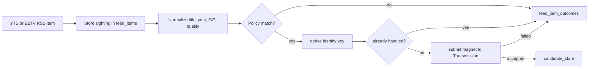

RSS is Pirate Claw’s automatic lane. It is also the lane most likely to be oversimplified as “read feed, download match.” The real pipeline preserves raw evidence, normalizes unreliable names, applies operator policy, deduplicates identities, submits a winner, and records both successful and rejected outcomes.

## The automatic path

The raw feed record is valuable even when no download occurs. It proves what Pirate Claw saw and gives later features something to replay. Normalization extracts the shape used for matching: movie title and year, or show title plus season and episode, along with resolution and codec hints when the filename carries them.

Policy is deliberately different for movies and TV. TV rules represent future intent for named shows and can carry strict matching or pinned TMDB identity. Movie policy is broader automatic selection. A rejected item is not necessarily an error; it may simply fall outside policy.

## Identity prevents “same release, new row”

RSS feeds repeat items. Providers change ordering. A daemon restarts. Without an identity key, each sighting looks new and the same magnet can be submitted repeatedly. `candidate_state` is the durable state machine for an RSS-matched identity, not just another copy of the feed entry.

The repository once accumulated roughly 44,000 `feed_items` rows representing around 2,300 distinct releases. The forward fix updates repeated sightings and adds indexes. It intentionally leaves historical duplicates alone rather than performing a risky cleanup migration on a live archive. That is mature v1 judgment: stop the bleeding, preserve evidence, postpone cosmetic history repair.

## Policy replay closes a temporal hole

An RSS item is normally matched when it is first processed. Suppose an episode appeared yesterday and the user tracks the show today. Without replay, the item is in Pirate Claw’s history but will never be reconsidered.

When a show is added, Pirate Claw performs a scoped replay of stored feed history for that newly added rule. “Scoped” is the important word. Replaying every TV and movie rule after every edit would turn one click into a surprising acquisition storm. The implementation restores the missed opportunity without reopening the whole past.

## Automatic does not mean opaque

The automatic lane should be explainable in four statements:

- what the provider published;
- how Pirate Claw parsed it;
- which rule or policy accepted or rejected it;
- what Transmission said when asked to enqueue it.

When one of those facts is absent, support becomes guesswork. V1 already has the right conceptual records, even if a single end-to-end event view remains future work.

## What metadata survives

RSS often carries better release metadata than a free-text provider result because the release name itself includes resolution, codec, source, or group. That advantage is contingent on naming quality. Pirate Claw cannot reliably invent `1080p` or `x265` when the provider omitted it.

Descriptions are a different category. They come from metadata enrichment, not the torrent filename. The acquisition path should record a canonical TMDB identity wherever possible; presentation can then join the current overview, poster, language, and rating from the cache. This is why identity quality matters more than copying every descriptive field into the acquisition row.

## Safe now, ambitious later

For v1, test RSS movie and RSS TV as separate contracts, preserve rejected outcomes, and keep replay scoped. Avoid rewriting the state machine or deduplication key before ship.

For v2, model `FeedSighting`, `ReleaseCandidate`, `PolicyDecision`, and `AcquisitionAttempt` explicitly. They are currently present in spirit across tables and functions; naming them would make the pipeline easier to inspect without changing its core behavior.

### In plain English

The feed is a newspaper, not an order. Pirate Claw clips each interesting ad, reads the messy headline, checks it against your standing instructions, makes sure it has not already acted, and only then calls the downloader.

### Key takeaway

RSS intake is a decision pipeline with durable evidence. Its value is not only automation; it is remembering why automation acted or declined.
