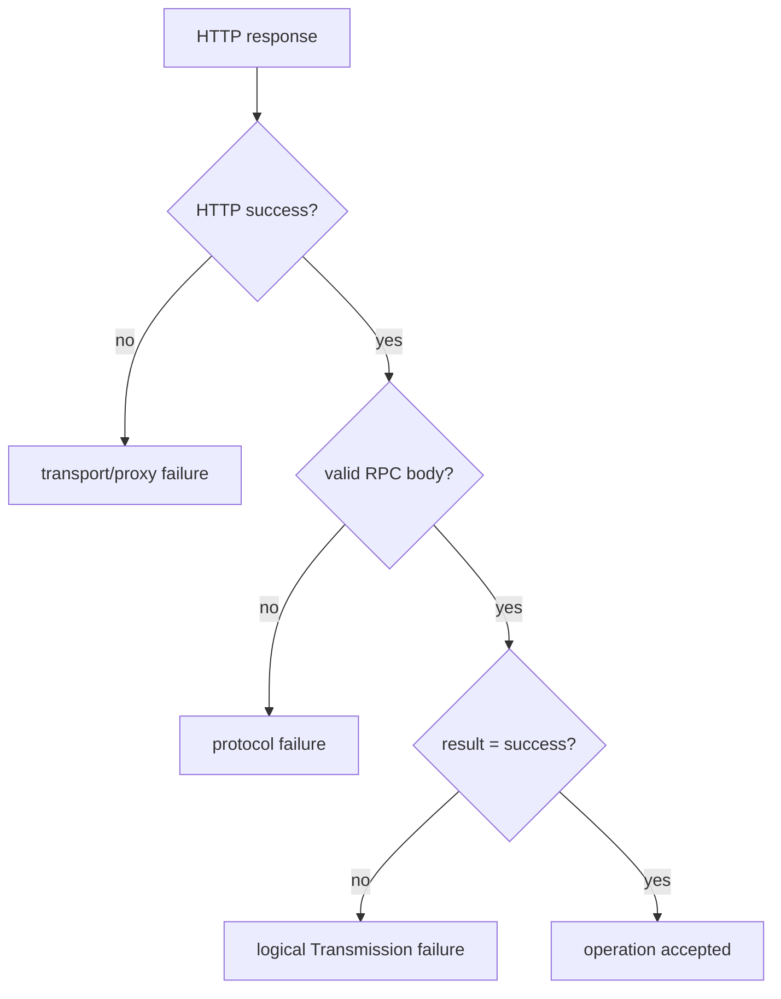

Transmission is the machine that moves bytes. Pirate Claw should command it, observe it, and recover around it—but should not pretend to be it. Calling Transmission an actuator keeps the architecture honest: Pirate Claw expresses intent; Transmission performs download work and owns the live state of that work.

## The command boundary

Pirate Claw uses Transmission’s RPC interface to add magnets, list torrents, inspect files, choose wanted files, start, stop, remove, and remove with data. The downloader may require a session-id handshake. More importantly, a successful HTTP response can contain a failed RPC result. Logging only the HTTP status would produce the classic lie: “200 OK” next to an operation that Transmission rejected.

The client therefore needs to inspect both layers:

That distinction belongs in user-facing errors too. “Transmission unreachable,” “Transmission refused the request,” and “torrent no longer exists” suggest different next actions.

## Torrent identity outlives display names

Names change, collide, and are not stable keys. Hashes and Transmission IDs connect Pirate Claw’s ledger to current downloader state. The UI may display the release title because it is legible, but actions must target the resolved torrent identity.

Per-hash locking in the Torrent Manager follows the same principle. Starting one torrent should not disable controls on every card. A global `pending` flag is easy to write and produces a subtly broken multi-row UI.

## File selection is not cosmetic

Season torrents make file-level selection a domain operation. A pack may contain samples, subtitles, extras, multiple seasons, or naming that Pirate Claw cannot confidently classify. The safe rule is conservative:

- show the file list;
- preselect what is confidently relevant;
- never auto-exclude uncertain files as if they were known junk;
- reject an empty wanted set;
- communicate when Transmission metadata is not yet complete enough to edit.

This is where a human-guided product beats a brittle threshold heuristic. The goal is not to make the click disappear; it is to put judgment at the one place where wrong automation deletes useful content.

## Completion is necessary, not sufficient

Transmission’s `percentDone = 1` proves the wanted bytes completed. It does not prove:

- the filename identifies the intended media;
- the media was moved into the expected directory;
- Plex scanned it;
- Plex matched the correct TMDB identity;
- the file is actually playable.

Pirate Claw may optimistically show download completion while separately waiting for Plex ownership evidence. Those are not contradictory states.

## The network boundary is part of safety

On the NAS, Transmission’s relationship with Gluetun and its network namespace is operationally sensitive. A web-only Pirate Claw deployment must not casually recreate downloader or VPN containers. On the Mac, the future bundled-app design must decide who owns the Transmission process, its ports, its data directory, and its lifecycle.

Those decisions are packaging architecture, not merely installer details.

### In plain English

Pirate Claw is the foreman handing work orders to a delivery truck. Transmission knows whether the truck is moving and whether the boxes arrived. It does not know whether Plex shelved the right movie under the right name.

### Key takeaway

Trust Transmission for live torrent state and RPC outcomes. Do not promote download completion into proof of library ownership.
