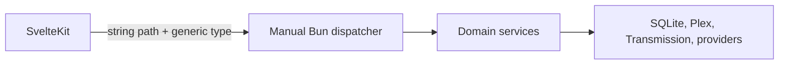
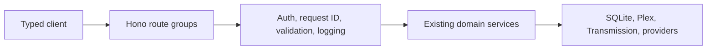

Pirate Claw already has a backend: the Bun daemon exposes a local HTTP API. The
opportunity is to make its contract more explicit, validated, and easier to
evolve.

## Today

The daemon's large dispatcher has accumulated real behavior and safety checks.
Its weakness is that paths, request parsing, auth checks, response shapes, and
error conventions are spread across a long route tree.

## A Hono-shaped future

Hono fits Bun's fetch model. It would organize the existing HTTP boundary; it
would not replace the daemon, SQLite, or business logic. The route handler's
job should stay small: validate input, authorize, call a domain service, and
map a typed result to an HTTP response.

## Contract layers

| Layer | Benefit | Caveat |
| --- | --- | --- |
| Shared TypeScript DTOs | Better editor help | No runtime proof that JSON matches |
| Runtime schemas | Validate requests and responses | Requires deliberate schema ownership |
| Hono RPC client | Typed paths, inputs, status responses | Split route groups to avoid a huge inferred type |
| Optional OpenAPI | External/client documentation | Extra generation and release discipline |

## Why this waits for v2 thoughtfulness

The November 1 v1 release benefits from stable behavior more than a wholesale
router migration. A safe future route is to migrate low-risk read endpoints
first, keep the old dispatcher available, and move mutations only after tests
and live smoke checks prove identical behavior.

## Key takeaway

Hono is valuable when it makes the contract visible. It is not a substitute for
clear domain boundaries or careful migration.
