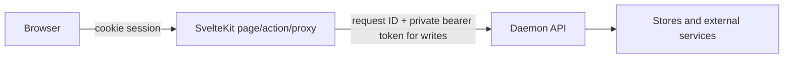
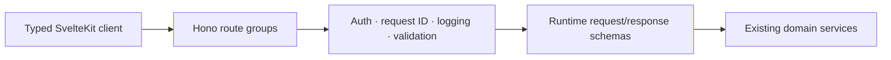

Pirate Claw already has a backend. The Bun daemon listens over HTTP, authorizes writes, parses input, invokes domain services, and returns JSON. Bringing in Hono would organize and harden that boundary; it would not conjure one into existence.

## The three-hop request



The web client talks to SvelteKit. SvelteKit owns the signed human session and calls the private daemon. Normal daemon requests allow up to 60 seconds because some discovery work chains providers. Navigation-sensitive reads use about 12 seconds and one jittered retry. Status polls use four seconds and no retry so they do not pile work onto a stressed daemon.

Those are contract decisions, not just constants.

## Where types stop today

SvelteKit often writes a TypeScript generic beside a fetch. That helps the editor believe the returned JSON has a shape. It does not validate the bytes. The daemon’s hand-written dispatcher also spreads path matching, authorization, body parsing, status selection, and error text across an API file of roughly eight thousand lines.

Failure modes include:

- web and daemon DTOs drift while both still compile;
- a missing browser proxy looks like a daemon route but returns SvelteKit 404;
- one handler returns `{ error }`, another a different failure envelope;
- invalid body fields are discovered deep in a domain call;
- route groups cannot easily advertise their mutations and freshness semantics.

The three missing browser proxies found during this audit are a concrete example: daemon handlers and browser calls exist, but the middle hop is absent. A route manifest or generated client would make that harder.

## What Hono would genuinely improve



Hono fits Bun’s fetch model and could provide route grouping, middleware, runtime validation, typed status unions, and optional OpenAPI generation. A handler should become boring: validate, authorize, call a service, map the result.

Hono will not solve multiple truth models, identity migration, cache freshness, background job ownership, transaction design, or SvelteKit invalidation. Moving eight thousand lines into router methods without extracting domain behavior simply reorganizes the file.

## The safe migration is a strangler

Do not replace the dispatcher in one flag day. Mount a Hono application beside it and migrate in slices:

1. Introduce one error envelope and request context.
2. Extract read-only health/status routes with contract tests.
3. Extract resource-shaped reads such as movie archive or show detail.
4. Move low-risk mutations with exact authorization and response parity tests.
5. Move complex streaming/provider routes last.
6. Delete the old dispatcher only after route inventory proves nothing remains.

During migration, test both behavior and call topology. A successful JSON snapshot is not enough if the new route accidentally makes three provider calls instead of one cached read.

## Contract design worth aiming for

Responses should express more than data:

```text
ResourceResponse<T> {
  data: T
  freshness: fresh | stale | unknown
  observedAt?: timestamp
  requestId: string
}

MutationResponse<T> {
  data: T
  effects: [movies.archive, transmission.torrents]
  requestId: string
}
```

Runtime schemas should be owned near the domain contract and shared with the web client. For large Hono RPC types, split route groups so TypeScript inference remains practical.

## November judgment

Do not migrate frameworks before November 1. Add the missing proxies, unify obvious error behavior, test the current boundary through SvelteKit, and finish the route/effect inventory. That evidence makes a later Hono migration safer.

### In plain English

The daemon is already a back office. Hono would replace the handwritten hallway signs, locks, and intake forms with a consistent system. It would not reorganize the warehouse inventory by itself.

### Key takeaway

Use Hono to make the HTTP contract visible and enforceable. Treat domain modeling, background jobs, and UI freshness as separate redesign work.
