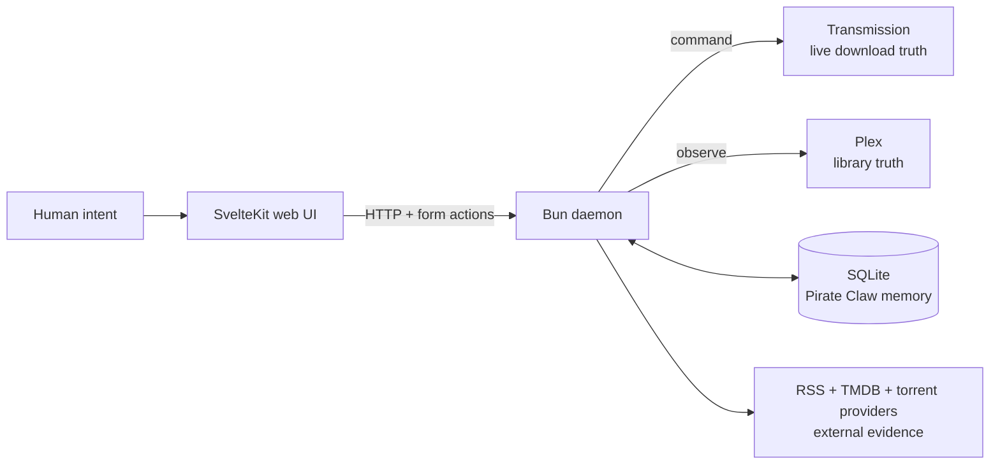

## 🦀 The machine behind Command & Control

Pirate Claw is a local media-acquisition control room. It discovers releases, lets a person make the calls that deserve judgment, hands downloads to Transmission, and uses Plex as the strongest practical evidence that the job is finished.

This guide is a teardown of the system that exists—not the tidier system we might draw on a whiteboard. It explains the good decisions, the accidental complexity, the operational scars, and the seams I would keep or replace if we built v2.

**V1 has a November 1 ship line.** Recommendations are marked accordingly: stabilize now, redesign later.

## Start with the four kinds of truth

The diagram looks simple because boxes hide arguments. SQLite can prove that Pirate Claw queued a torrent; it cannot prove the movie is playable in Plex today. Transmission can report 100 percent complete; it cannot prove Plex matched the file to the intended title. TMDB can name a show; it cannot prove that a torrent actually contains it. A surprising amount of v1 is the careful negotiation among those facts.

> **Mentor's note:** When the UI looks wrong, do not begin with the component. First ask which system owns the disputed fact, how stale that fact may be, and whether the screen is showing observation, intent, or inference.

## What this guide does differently

This is not generated API reference and it is not a victory lap. Each chapter answers five questions:

1. What does the code do today?
2. Why did it end up that way?
3. What does that mean in ordinary language?
4. Where can it fail or mislead us?
5. Is the right move a safe v1 improvement or a v2 redesign?

The route chapters inventory initial requests, user-triggered mutations, idle polling, and invalidation behavior. The engine-room chapters follow work from discovery through adoption. The data chapters explain why “the database” is not a single source of truth. The final chapters turn the evidence into product, packaging, licensing, and pricing decisions.

## Read it in one of three ways

**The owner’s path** starts with [Read the system before the code](/start-here/the-big-picture/), follows [A request from tap to library](/start-here/walking-tour/), then jumps to [Value and pricing](/strategy/value-and-pricing/) and [If we started fresh](/strategy/rebuild-and-roadmap/).

**The engineer’s path** follows the sidebar in order. The ordering is intentional: process boundaries before tables, tables before UI, current behavior before redesign.

**The operator’s path** starts at [Mac target, NAS evidence](/operations/mac-and-nas/), [Observability and debug logs](/operations/observability-and-debugging/), and the [Failure playbook](/operations/failure-playbook/).

Every chapter has precompiled Kokoro narration. The sticky player keeps your place and the global play/pause shortcut works across pages. The audio is a second way through the same material, not a thinner summary.

## The complete guide

| Section | What it teaches | Begin here |
|---|---|---|
| Orientation | The vocabulary and a complete end-to-end trip | [The big picture](/start-here/the-big-picture/) |
| Engine room | Feed intake, manual grabs, adoption, Plex, Transmission, providers | [Processes and boundaries](/architecture/process-map/) |
| Memory and identity | Tables, truth ownership, matching, cache semantics | [Who owns each fact?](/architecture/data-and-truth/) |
| Web application | Every major route, request, event, and idle update | [Web-to-daemon contract](/architecture/typed-daemon-boundary/) |
| Operating v1 | Performance, logs, recovery, and the November line | [Mac target, NAS evidence](/operations/mac-and-nas/) |
| Product and v2 | Licensing, packaging, pricing, and redesign | [Providers and lock-in](/reference/providers-and-licensing/) |

The sidebar is the table of contents on desktop. On a small screen it lives behind the menu. The sequence contains more than thirty focused chapters; no “atlas” page is expected to teach the whole product anymore.

## Chapter directory

The full directory is repeated here deliberately so mobile readers never have to discover a hidden navigation convention.

### Orientation

- [Read the system before the code](/start-here/the-big-picture/)
- [What is fact, inference, or advice?](/start-here/evidence-and-vocabulary/)
- [A request from tap to library](/start-here/walking-tour/)

### The engine room

- [Processes and boundaries](/architecture/process-map/)
- [The daemon and its clocks](/architecture/daemon-and-workers/)
- [RSS intake and candidate policy](/architecture/rss-and-policy/)
- [Manual acquisition paths](/architecture/manual-acquisition/)
- [Reconciliation and adoption](/architecture/reconciliation-and-adoption/)
- [Transmission is an actuator](/architecture/transmission/)
- [Plex is the ownership witness](/architecture/plex/)
- [TMDB and release providers](/architecture/metadata-and-providers/)

### Memory and identity

- [Who owns each fact?](/architecture/data-and-truth/)
- [SQLite schema tour](/architecture/database-tour/)
- [Identity is the hard problem](/architecture/identity-and-matching/)
- [Caches, freshness, and fallbacks](/architecture/caches-and-freshness/)

### The web application

- [Web-to-daemon contract](/architecture/typed-daemon-boundary/)
- [Layout and global background work](/routes/layout/)
- [Dashboard](/routes/dashboard/)
- [Movies archive](/routes/movies/)
- [Movie discovery](/routes/movie-discovery/)
- [Shows library](/routes/shows/)
- [Show detail and episode grabs](/routes/show-detail/)
- [TV discovery](/routes/tv-discovery/)
- [Configuration and onboarding](/routes/configuration/)
- [Events and update cascades](/architecture/event-cascades/)

### Operating v1

- [Mac target, NAS evidence](/operations/mac-and-nas/)
- [Observability and debug logs](/operations/observability-and-debugging/)
- [Failure playbook](/operations/failure-playbook/)
- [What must ship by November 1](/strategy/v1-ship-line/)

### Product and v2

- [Providers, licenses, and lock-in](/reference/providers-and-licensing/)
- [The Mac app path](/strategy/mac-product/)
- [Value and pricing](/strategy/value-and-pricing/)
- [If we started fresh](/strategy/rebuild-and-roadmap/)

## The thesis in one paragraph

Pirate Claw’s value is not “it can add a magnet to Transmission.” Many tools can. Its value is the opinionated loop around that act: continuous discovery, identity-aware human review, visible downloader control, historical memory, and a Plex-backed answer to “did I get it?” V1 proves that loop works. V2 should make the boundaries explicit, typed, observable, and installable without sanding away the human judgment that makes the product useful.

### In plain English

Pirate Claw is the foreman. It does not manufacture movie facts, download bytes, or play video by itself. It coordinates specialists, remembers the decisions, and gives the owner one place to see whether the job worked.

### Key takeaway

Learn Pirate Claw as a conversation among systems, not as a pile of pages and endpoints. Once you know who owns each fact, both the strengths and the rough edges become much easier to reason about.
