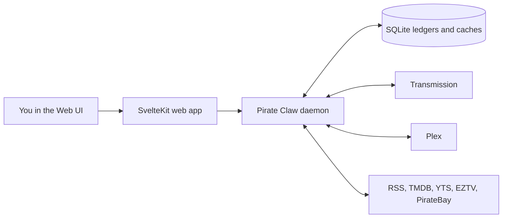

## 🦀 Command & Control, explained

Pirate Claw is a local media-acquisition control room. It watches feeds, lets a human search and choose releases, asks Transmission to download them, remembers what happened, and uses Plex as evidence that a title made it into the library.

**V1 ships November 1.** This guide is deliberately not a late rewrite proposal. It is a map of where v1 lands, what it already does well, and the evidence we want in hand when v2 becomes a real conversation.

## The one-breath model

### In plain English

The screen is a remote control, not the whole machine. The daemon does the
work. SQLite remembers Pirate Claw's own history. Transmission knows the live
state of a download. Plex is the best answer to the practical question: is it
actually in my library? External providers supply candidates and metadata.

### Key takeaway

When two screens disagree, ask **which system owns that fact** before trying to
fix the UI.

## How to use this guide

Every chapter has the same promise:

- **Technical view** explains the real components and contracts.
- **Plain-English view** says what that means without pretending the system is simpler than it is.
- **Key takeaway** names the one idea worth retaining.
- **Evidence** separates current observations from redesign opinions.

Use the narration control below each title if you want an eyes-off tour. Audio
is generated locally at build time with Kokoro, not synthesized in your
browser.

## Guide map

### Start here

- [The big picture](/start-here/the-big-picture/)
- [Evidence and vocabulary](/start-here/evidence-and-vocabulary/)

### How v1 works

- [Daemon and background work](/architecture/daemon-and-workers/)
- [Data, caches, and truth](/architecture/data-and-truth/)
- [Acquisition pipeline](/architecture/acquisition-pipeline/)
- [Routes, requests, and idle work](/architecture/route-atlas/)
- [Events and update cascades](/architecture/event-cascades/)
- [Typed daemon boundary and Hono](/architecture/typed-daemon-boundary/)

### Operating and evolving it

- [Mac target and NAS evidence](/operations/mac-and-nas/)
- [Observability and debug logs](/operations/observability-and-debugging/)
- [Providers, TMDB, Plex, and licensing](/reference/providers-and-licensing/)
- [If we started fresh](/strategy/rebuild-and-roadmap/)
- [Value and pricing experiment](/strategy/value-and-pricing/)
