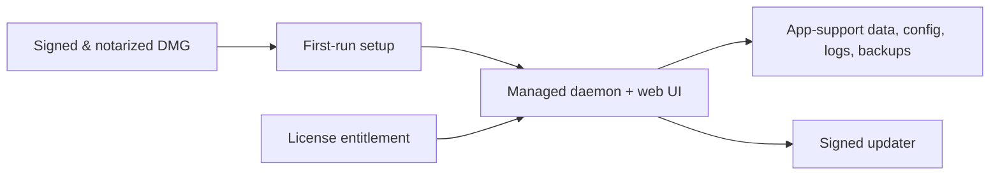

Pirate Claw has earned operational knowledge on a Synology NAS. That is useful:
it proves the workflow runs with constrained CPU, storage, and network
conditions. But the intended customer machine is an M-series Mac mini, so the
Mac defines the performance bar.

## Evidence versus benchmark

| Question | NAS is good for | Mac is good for |
| --- | --- | --- |
| Does state survive real use? | Yes | Yes |
| Does a cold route work? | Yes | Yes |
| What should perceived latency be? | No | Yes |
| Is polling too expensive? | A warning signal | The decision basis |
| Is deployment operationally safe? | Yes | Eventually, a packaging rehearsal |

## What to measure on the Mac

- First navigation, warm navigation, and direct deep-link time.
- Server and daemon request count per route.
- Hydration and payload size, especially on Discovery pages.
- Time from a mutation to the UI reaching a stable state.
- CPU, memory, and event-loop lag while Dashboard polling is active.
- TMDB, Plex, and Transmission time split, rather than one “page was slow” number.

## DMG path

The productization sequence is: stabilize runtime ownership; make data,
backups, migration, and diagnostics explicit; package and notarize; add updates;
then add entitlement/payment support. Payment is not a daemon concern. It
should be a small entitlement service with a signed local license token and a
thoughtful offline policy.

## In plain English

The NAS is the old truck that taught us which roads have potholes. The Mac mini
is the vehicle we are selling. We should learn from the truck without tuning
the customer experience around its slowest behavior.

## Key takeaway

Use the NAS to validate operations. Use the Mac to make performance decisions.
