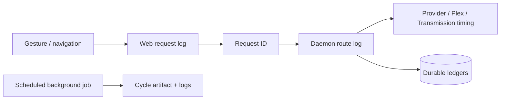

Pirate Claw’s observability is better than a three-week prototype has any right to be. It is also not yet a support bundle or a complete causal history. Both statements should be true at once.

## What exists

- Web-to-daemon request IDs.
- Web and daemon route duration/outcome logs.
- Daemon stress state attached to route logs.
- Outbound HTTP duration and status logging.
- Logical Transmission RPC outcome logging in addition to HTTP status.
- Event-loop lag detection.
- Browser render-error forwarding.
- Navigation timing.
- Cycle timing artifacts.
- Durable manual-grab failures and torrent-error observations.
- Acquisition and outcome ledgers that survive removal from Transmission.

The broken line in this story is background work: periodic feeds, reconciliation, TMDB/Plex refresh, and adoption do not inherit a user request ID. They have cycle context, but no universal trace that links a user’s earlier grab through later completion and Plex confirmation.

## What you can answer today

With logs and data together, an operator can often answer:

- Did the page reach SvelteKit and the daemon?
- How long did the daemon route take?
- Was the event loop stressed at the time?
- Did an outbound provider fail or return no results?
- Did Transmission reject the logical RPC despite HTTP success?
- Was a candidate skipped, failed to enqueue, or later reconciled?
- Did the browser throw during rendering?

That is real operational leverage.

## What still requires hand reconstruction

The desired sentence is:

> User chose release X; Transmission accepted hash Y; reconciliation observed completion; Plex later confirmed media identity Z.

Today pieces live in two process logs, live Transmission, acquisition ledgers, and Plex caches. Shared identities often make reconstruction possible, but the system does not emit one durable causal timeline.

V2 should append domain events with correlation/causation IDs. That does not require Kafka. A SQLite event table can be enough if events are structured, bounded, and linked to acquisitions.

## Be precise about redaction

Current logging redacts a small list of sensitive query parameters and avoids casually printing some secrets. It does not prove that every hostname, private IP, media title, provider query, response preview, path, header, or body field is safe to share.

Therefore current logs are **operator logs**, not a guaranteed sanitized diagnostic export. A paid product needs a dedicated export pipeline with allowlisted fields, path/IP/token scrubbing, tests with seeded secrets, and an on-screen preview before sharing.

## Logging gaps worth closing for v1

- Emit structured cycle counters: rows scanned/changed, provider calls, skips, and duration.
- Log skipped job reason and concurrency key.
- Include cache freshness and whether a response was fresh, stale, or last-known-good.
- Record the exact downstream effect of important mutations.
- Document log locations and a manual redaction procedure.
- Add an operator-visible request ID to actionable error messages.

These improve support without redesigning the system.

## Logs are not metrics

Request logs can later produce route latency, error counts, provider health, and cache-hit rates, but hand-grepping is not the final product. For v2, keep local-first metrics in a bounded SQLite/time-series store and make telemetry opt-in. The owner should be able to see provider health and route slowness without sending media activity anywhere.

### In plain English

V1 has useful receipts from each counter. It does not always staple them into one order folder, and the receipts may contain private operational detail. V2 should create the folder and a safe photocopy process.

### Key takeaway

Observability becomes product-grade when it connects intent to eventual outcome and can be shared safely. V1 is diagnosable; it is not yet fully traceable or sanitized.
