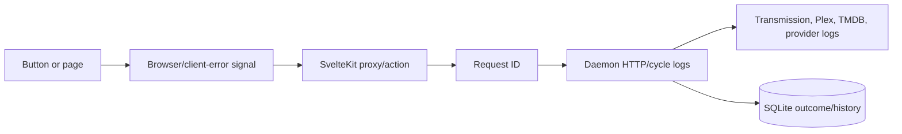

When Pirate Claw feels wrong, the operator needs an answer to four questions: what happened, where did it happen, how long did it take, and what changed as a result?

## What v1 already has

- Daemon health exposes start time, active cycle, recent cycle history, and stress signals.
- HTTP request logging carries request context through daemon work.
- Outbound provider calls are wrapped so latency and failure details can be logged safely.
- Client error reporting captures browser-side failures without making the UI silently disappear.
- Repositories and ledgers retain meaningful acquisition outcomes after a torrent is gone.
- Several UI paths preserve last-known-good results when a transient daemon call fails.

## The debug story today

## Gaps worth naming honestly

| Gap | Why it matters | Low-risk v2 investigation |
| --- | --- | --- |
| No single causal timeline | Hard to connect click to update | Correlation ID visible in UI, web, daemon, and logs |
| Invalidation is mostly invisible | Broad cascades hide in the browser | Dev-only event and invalidation inspector |
| Request cost is not summarized per route | “Slow” has no breakdown | Capture count, bytes, p50/p95, and dependency split |
| Provider behavior is heterogeneous | Retries and failure semantics vary | Provider health cards with last success/failure |
| Cache freshness is not universally visible | Cached data can look live | Display source and observed-at timestamp where useful |

## Redaction rule

Logs should never casually expose provider credentials, Plex tokens, raw authorization headers, private IPs, or personal media paths. Observability is only useful if it is safe to share while debugging.

## In plain English

V1 has useful receipts, but it does not always have a clean movie of the whole incident. V2 should make it easy to see why a click refreshed three panels or why a title stayed unknown without asking an operator to reconstruct events by hand.

## Key takeaway

Logging becomes product-quality observability when it connects user intent, system work, and the eventual visible result.
