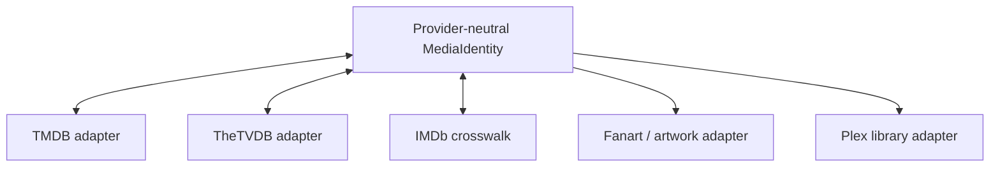

Provider choice becomes product architecture the moment Pirate Claw charges money. Technical capability, identity stability, rate limits, attribution, caching, image rights, and commercial terms all belong in the decision.

This is engineering guidance, not legal advice. Terms can change; confirm the agreement before launch.

## TMDB today

TMDB is embedded across discovery, identity, IMDb crosswalks, overviews, language, ratings, artwork, seasons, and episodes. Its official FAQ says the developer API is free for non-commercial use with attribution, while a revenue-producing product needs a commercial arrangement. Its terms also specify attribution and limit long-term caching under the general license. See the [TMDB API FAQ](https://developer.themoviedb.org/docs/faq) and [API terms](https://www.themoviedb.org/api-terms-of-use).

That means “bring your own TMDB key” does not automatically make a paid Pirate Claw product commercially safe. If the paid product derives value from the integration, obtain written clarity from TMDB rather than designing around wishful key ownership.

## TheTVDB is commercially legible, not a drop-in

TheTVDB publishes a revenue-tier schedule: under $50,000 annual revenue is currently free with required attribution; $50,000–$250,000 is $1,000/year; $250,000–$1 million is $10,000/year; larger/custom use requires contact. Attribution is required unless approved otherwise. See [TheTVDB API and data licensing](https://thetvdb.com/api-information).

That pricing clarity is attractive for a small commercial product. It does not erase migration cost:

- all existing manual movie/show history is keyed to TMDB;
- tracked-show pins and rejections encode TMDB identity;
- Plex frequently exposes TMDB GUIDs useful for ownership joins;
- endpoint and DTO names encode TMDB;
- episode/season shape and release-date semantics may differ;
- existing cached images and descriptions need retention rules.

TheTVDB should first be an additional identity/metadata adapter behind qualified IDs, not a replacement flag flipped across v1.

## Fanart.tv is enrichment, not identity

Fanart.tv can supply movie, TV, and music artwork. Its current API documentation describes project and personal keys with different freshness delays, and the site makes clear that underlying image copyrights remain with their owners. See the [Fanart.tv API](https://api.fanart.tv/), [key model](https://fanart.tv/get-an-api-key/), and [terms](https://fanart.tv/terms-and-conditions/).

It is useful as an artwork adapter. It should not become the canonical media identity source. A provider-neutral asset model should record source, URL/cache key, dimensions, kind, attribution, observed time, and removal policy.

## Torrent and scrape providers

YTS, EZTV, APIBay/Pirate Bay, RSS feeds, and DVD Release Dates differ from metadata catalogs:

- YTS and EZTV depend on IMDb identity for structured search.
- APIBay is a text/category search over an unofficial mirror.
- RSS is push-like discovery with repeat sightings.
- DVD Release Dates is scraped HTML and can break when markup changes.

Their endpoints are currently hardcoded. A paid product needs configurable base URLs, health diagnostics, timeouts, result validation, and a rapid disable/fallback mechanism. It also needs a legal review appropriate to distribution territories and the product’s intended use. A technical adapter does not resolve rights or policy risk.

## Plex dependence is a product decision

Assuming Plex for v1 customers is defensible because it gives Pirate Claw a clear ownership witness and a focused onboarding contract. Document supported Plex versions/topologies and the required library layout. Do not advertise generic media-server support until another adapter passes the same identity and completeness tests.

## Migration architecture

The migration sequence is:

1. inventory every TMDB ID persistence point and response field;
2. introduce qualified IDs without removing TMDB columns;
3. backfill crosswalks with source/confidence;
4. add another provider for a narrow read-only capability;
5. compare identity and episode mappings;
6. move one surface at a time;
7. preserve historical identities indefinitely or with explicit tombstones.

## Decision for v1

Do not replace TMDB before November. Resolve the commercial conversation, add required attribution, enforce cache policy, test a truly cold BYO-key-free profile, and document which features require metadata identity.

### In plain English

TMDB is woven into Pirate Claw’s address book, not pasted on as artwork. TheTVDB has clearer public small-business pricing, and Fanart can improve the pictures, but moving requires translating every saved address without losing history.

### Key takeaway

Commercial metadata choice is identity architecture plus licensing. Negotiate v1 honestly; design provider-neutral migration for v2.
