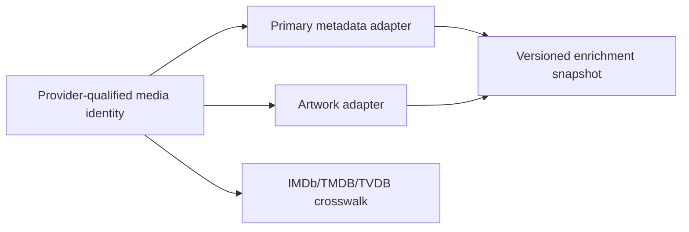

Pirate Claw is intentionally local, but it depends on external information and external systems. The point is not to deny those dependencies; it is to state what each one contributes.

## Dependency map

| Dependency | What it supplies | What it does not prove |
| --- | --- | --- |
| RSS, YTS, EZTV, PirateBay | Candidate releases and torrent metadata | Library ownership or canonical media identity |
| Transmission | Live torrent state and queue control | Whether Plex imported a completed file |
| TMDB | Discovery, identity help, overviews, artwork, ratings, language, episode metadata | A file's real torrent quality or Plex presence |
| Plex | Current library-presence evidence | Full historical acquisition provenance |
| DVD Release Dates | Top Movies source material | The final metadata shown in the UI |

## Without a TMDB key

| Capability | Cold install without TMDB | Why |
| --- | --- | --- |
| RSS intake and Transmission | Works | They do not require TMDB to move a torrent |
| Existing Plex presence | Mostly works | Plex is a separate integration |
| Filename resolution/codec | Sometimes works | Derived from release/file names |
| Movie and TV discovery | Materially degraded | Calendars and candidate enrichment rely on TMDB |
| Posters, overview, rating, language | Degraded | Metadata provider missing |
| Episode and season metadata | Degraded | TMDB TV cache supplies the canonical episode map |
| Top Movies | Degraded | Scraped candidates still need TMDB enrichment |

Existing cache can make a missing-key installation look healthier than a truly cold install. The exact degraded-mode experience should be tested on a clean Mac profile before it becomes a product claim.

## Replacement thought experiment

TheTVDB could become a TV metadata source, and Fanart.tv could supplement artwork. Neither is a one-line TMDB replacement. TMDB identities, cache tables, matching, seasonal data, image URLs, and tests are woven through v1.

Commercial licensing must be decided from current provider terms, not assumed from an old comparison. Image rights, attribution, cache permission, rate limits, and end-user versus project licensing all matter.

## Key takeaway

TMDB is more than posters in v1. Replace it only after identity and provenance are separated from any one provider.
