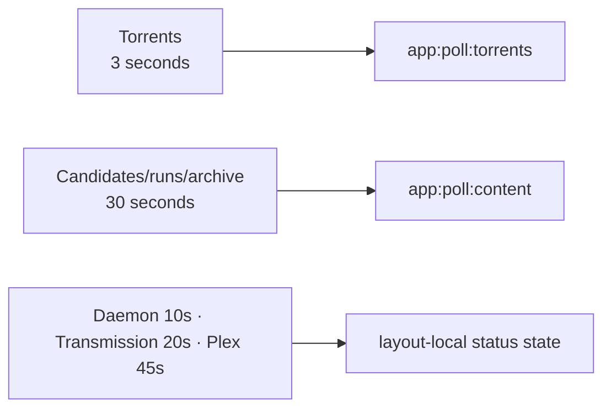

The Dashboard is Pirate Claw’s busiest page, but its architecture is more disciplined than a simple call count suggests. It separates fast-changing torrents from slower content and global status, projects large records before hydration, and preserves prior sections when one refresh fails.

## Initial data beyond the layout

| Read | Visible responsibility |
|---|---|
| `GET /api/candidates` | Automatic candidate state and missing torrents |
| `GET /api/status` | Run history, skips, and failures |
| `GET /api/outcomes?status=failed_enqueue` | Transmission Failures card |
| `GET /api/manual-grabs/completed` | Manual half of Your Haul |
| browser `/api/poll/torrents` → daemon `/api/transmission/torrents` | Torrent Manager plus tracked manual grabs |
| browser `/api/shows-slugs` → daemon `/api/shows/slugs` | Safe links from items to show detail |

The four content reads start concurrently. Torrent data lives in a separate universal load because SvelteKit invalidates a whole load function when any declared dependency changes. Separate load units are what allow separate cadences.

Candidate records are projected before going to the browser. Overview, backdrop, download URL, and feed fields that the dashboard never renders are removed. That matters because the daemon’s candidates response was measured around 188 KB even while taking only 8–10 ms on a warm Mac. Backend latency is not the whole page budget.

## Three update tiers

All loops pause when the page is hidden or navigating. Failed content refreshes retain the last successful value for each field. A status outage should not erase torrents already on screen.

## User actions and effects

The page can pause, resume, resume immediately, remove, remove with files, dispose a missing candidate, auto-reconcile, retry/dismiss failed candidates, and inspect or trim torrent files. Normal Torrent Manager actions refresh the torrent and content keys rather than the shared layout. A short delayed torrent refresh accounts for Transmission’s state not changing atomically with its RPC response.

The outlier is the Transmission Failures card. Retry/dismiss currently triggers `invalidateAll()`, waits briefly, and triggers it again. One click can repeat the layout’s eight reads and all dashboard data twice.

That is a good pre-November target: use the existing torrent/content dependency keys. It changes refresh scope, not domain behavior.

## What is particularly good here

- Volatility is modeled instead of giving everything a three-second poll.
- Polls do not overlap.
- Last-known-good prevents refresh failures from masquerading as empty state.
- Browser payloads are projected.
- Per-hash pending state prevents one torrent action from freezing all cards.
- File trimming stays human-reviewable.

Those choices came from incidents and should survive any rewrite.

## What belongs to v2

An event stream could push torrent changes and eliminate the three-second loop. Do not adopt WebSockets merely because they sound modern; the current poller is simple, bounded, and understandable. The v2 justification is better causal events and lower idle traffic, not fashion.

### In plain English

The Dashboard watches three clocks: downloads quickly, acquisition history less often, and system status at its own pace. If one update fails, it keeps the last readable instrument panel instead of painting the gauge empty.

### Key takeaway

The Dashboard already demonstrates the right v2 instinct: isolate resources by how quickly they change. Fix the one broad refresh hotspot without replacing the model.
