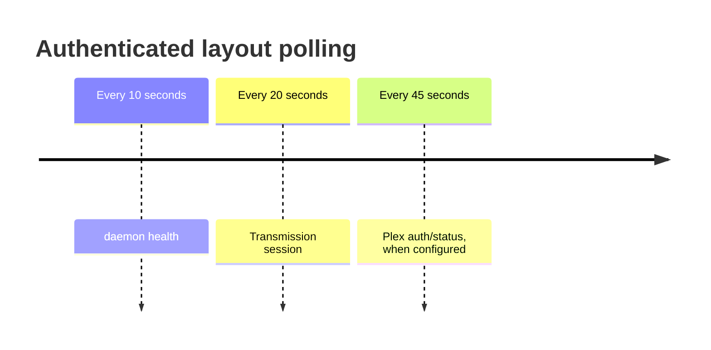

Before judging any route’s cost, add the shared layout. An authenticated navigation starts up to eight daemon reads concurrently. This shell supplies sidebar health, setup banners, Plex state, network posture, and parent data used by child routes.

## Initial request ledger

| Daemon read | What it powers |
|---|---|
| `GET /api/health` | Daemon uptime, health, and stress |
| `GET /api/transmission/session` | Transmission connection state |
| `GET /api/config` | Plex-configured state and child config |
| `GET /api/setup/state` | Starter versus configured shell |
| `GET /api/setup/readiness` | Restart-required state |
| `GET /api/setup/install-health` | Installation health |
| `GET /api/plex/auth/status` | Plex connection and version |
| `GET /api/auth/state` | Trusted origins and network posture |

Unauthenticated Login and Setup pages skip everything except setup state. Calls use `Promise.allSettled`, which is the right posture: one weak dependency should not turn the whole shell into a server error. Failure also stays distinct from a confirmed negative. If auth-state cannot be reached, the layout does not invent an untrusted origin.

## Idle work is split by volatility

Browser poll endpoints proxy to the daemon with a four-second, no-retry budget. Normal navigation calls have a longer budget and retry posture. That is intentional: a status light should miss one tick rather than pile up work behind a struggling service.

The shared poller is self-rescheduling, pauses in hidden tabs, and avoids ticks during navigation. That design came from a real failure mode: blind intervals can start another request before the first finishes and amplify an already stressed daemon.

Every document load and client navigation also posts best-effort navigation telemetry to the web process. It does not call the daemon.

## Restart is correctly broad

Daemon restart is one case where `invalidateAll()` fits. A restart can change health, config-derived dependencies, sessions, caches, and every page resource. The browser submits the restart, polls status once per second for up to 45 seconds, then refreshes all loaded data after the daemon returns.

The lesson is not “never invalidate all.” It is “match invalidation scope to mutation scope.”

## Pre-ship correctness finding: three browser calls lack proxies

Source audit found browser call sites for:

- `GET /api/setup/readiness` from the onboarding completion poll;
- `POST /api/auth/trust-origin`;
- `POST /api/auth/acknowledge-network-posture`.

The daemon handlers exist, but matching SvelteKit browser-facing routes were not found. In the shipped topology only the web service is exposed; direct browser requests resolve inside SvelteKit. The two auth writes also require the private bearer token, so they must be proxied server-side rather than pointed at the daemon.

This is not v2 architecture polish. It is a November correctness item and needs a real integration test through SvelteKit.

## Cost model

Eight concurrent reads do not mean eight times the latency, but they create eight opportunities for contention and payload work. Pages that refetch config, Transmission session, or Plex auth repeat that load. Config and Onboarding currently do.

For v1, reuse safe parent data, preserve ETags where required, and add the missing proxies. For v2, define a compact shell-status endpoint or cache status resources independently—but only after measuring whether the eight-call fan-out is a real Mac bottleneck.

### In plain English

Every room in the house inherits the same electrical panel. Before the room loads its own furniture, the app checks power, downloader, Plex, setup, and security state. Background lights then check in at different speeds instead of all flickering together.

### Key takeaway

Route cost starts with the layout. Its failure semantics and non-overlapping status loops are strong; missing browser proxies are a concrete pre-ship bug.
