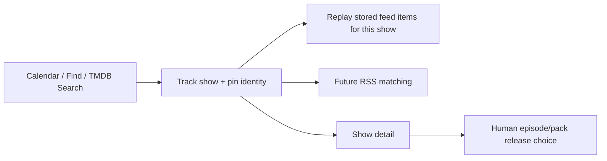

The tab order—Calendar, Find, Tracked, then a visual separation before Search—reflects four different questions: what is airing, what might I want, what do I already follow, and what exact thing am I hunting for?

## Initial load and lazy tabs

SSR always fetches `GET /api/calendar/tv?limit=PAGE_SIZE`. As with Movie Discovery, the active tab lives in `sessionStorage`, so a returning user pays for Calendar even if the browser restores Search.

Find, Tracked, and Search lazily fetch `/api/shows` the first time one of them needs the tracked set. Calendar paging is bounded to six mounted chunks, deduplicates TMDB IDs, and uses a browser timeout to avoid an eternal spinner.

## Tracking is not grabbing

Adding a show calls the configuration mutation path, pins TMDB identity when available, updates the dedicated tracked-show ledger, and triggers scoped replay of stored feed history. It changes future automatic intent.

It does not need to select a torrent at that moment. Episode and season-pack acquisition happens later from show detail or the TV Search panel.

That separation is healthy. A watchlist expresses durable interest; a grab expresses a concrete release choice.

## Request and event ledger

| Event | SvelteKit route/action | Daemon call(s) |
|---|---|---|
| First paint | page load | `GET /api/calendar/tv?limit=PAGE_SIZE` |
| Calendar paging | `/tv-discovery/more` | `GET /api/calendar/tv` |
| First open of Find, Tracked, or Search | `/tv-discovery/tracked` | `GET /api/shows` |
| Find a TMDB show | `?/searchTmdbShows` | `GET /api/tmdb/tv/candidates` |
| Add tracked show | `?/addShow` | `GET /api/config`; optional `GET /api/shows` for a title collision; then `PUT /api/config` |
| Search a season/release | `/shows/:slug/search` | `GET /api/shows/:slug/search` |
| Grab season pack | show-detail `?/manualGrab` | `POST /api/shows/:slug/manual-grab`, episode `0` as pack sentinel |

Adding a show reads config, may resolve an existing same-name show, then writes the full rule list. The collision read is conditional rather than paid on every add.

Adding from Calendar or Find patches local tracked state instead of reloading the calendar and losing already fetched chunks. This is the right mutation model and should be left alone for v1.

## No idle polling

The route has no recurring page poll. It reacts to tab changes, scroll, search, and submissions. A failed lazy tracked-list request retries on explicit interaction rather than spinning indefinitely.

## What v2 should change

Put active tab and meaningful filters in the URL. That gives shareable state, correct browser history, and enough server context to avoid loading Calendar for a Search visit.

Replace full-config watchlist rewrites with resource mutations such as `POST /tracked-shows`, `PATCH /tracked-shows/:id`, and `DELETE`. Preserve pinning, same-name disambiguation, strict mode, and scoped replay semantics behind those cleaner endpoints.

### In plain English

TV Discovery is the notebook where you decide which series to follow. Following a show tells Pirate Claw to watch future newspapers and reconsider recent ones. Choosing a specific episode torrent is a later shopping decision.

### Key takeaway

The route correctly separates tracking from acquisition and uses local patches well. URL-owned tabs and granular tracked-show APIs are v2 improvements.
