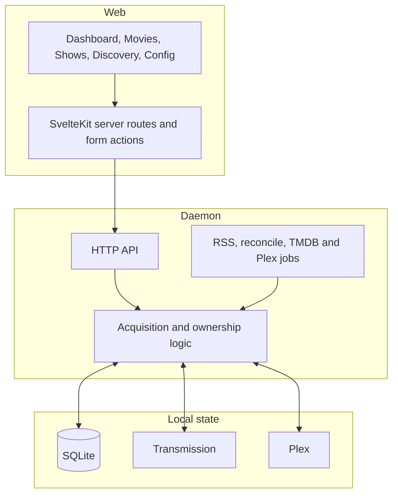

Pirate Claw v1 is a local-first control plane for a personal media workflow.
It is intentionally not a “one click and forget it” downloader. Its useful
personality is that a person can discover, inspect, choose, trim, queue, and
verify media without losing the system's history.

## Technical view

The web app has its own server-side layer. Browser requests often hit a
SvelteKit route or action first; that server route calls the daemon; the daemon
may then call Transmission, Plex, or a provider. Treating those as one network
request hides latency and privacy boundaries that matter.

## In plain English

You push a button in a web page. That page may ask its own server for help. The
server asks Pirate Claw's engine. The engine talks to the downloader, Plex, and
internet services. Several things can be true at once, and each may update at a
different pace.

## What v1 does well

- Keeps acquisition history locally instead of treating a torrent client as the only memory.
- Lets a human review a release before it is sent to Transmission.
- Treats Plex presence separately from “we tried to grab this.”
- Supports both RSS automation and manual discovery without pretending they are identical.

## What this means for v2

V2 should preserve the human-in-the-loop flow and explicit ownership semantics.
The opportunity is cleaner boundaries, not more automatic behavior for its own
sake.

## Key takeaway

Pirate Claw is a coordination system. Its complexity comes from coordinating
several honest-but-different sources of truth.
