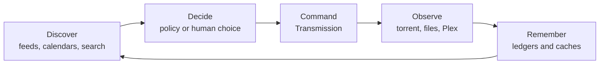

Pirate Claw grew quickly—roughly 120 hours across about three weeks—because it chased a real workflow rather than an abstract architecture. That is why the code contains both sharp product judgment and seams that would look different in a greenfield design.

The first job of this guide is to stop you from evaluating those seams with the wrong mental model.

## It is a control plane, not a downloader

Transmission is already a good downloader. Plex is already a good media library. TMDB is already a good metadata catalog. Pirate Claw earns its place by coordinating the gaps among them:

- noticing worthwhile releases without constant searching;
- keeping automated policy separate from human selection;
- preserving canonical identity across noisy filenames;
- exposing live downloader control without becoming the downloader;
- remembering what was attempted and why;
- reconciling delayed completion;
- using Plex to answer whether the intended media finally exists.

That loop is the product.

## V1 is an evolved system

Several current structures are responses to things that failed:

- A fast reconcile timer created enough pressure to delay feed polling, so its default became conservative.
- Historical candidates once stood in for tracked shows, which allowed removed shows to return; `tracked_shows` now owns intent.
- Parallel Transmission/filesystem adoption could record the same episode twice; the operations are now sequential.
- Blind `setInterval` polling could stack requests during stress; the browser poller now self-reschedules and pauses while hidden.
- One global pending flag disabled unrelated torrent cards; actions now lock by hash.
- Full candidate objects made mobile hydration unnecessarily heavy; dashboard DTOs now project fields.

These are architectural lessons disguised as implementation details. A senior rewrite preserves the lesson even when it replaces the mechanism.

## The product has two personalities

The automatic personality consumes RSS and standing policy. The manual personality lets a human browse calendars/charts, identify media, compare concrete releases, inspect pack files, and choose. Both eventually command Transmission and seek Plex confirmation, but they carry different provenance and certainty.

That duality is a feature. Media release names and provider data are messy enough that full automation becomes either reckless or timid. Pirate Claw’s best UX puts human judgment at expensive ambiguity and automates repetition around it.

## The November constraint

V1 needs to ship by November 1. That changes the meaning of “improvement.”

**Good v1 work:** correctness, bounded retries, actionable errors, narrow invalidation, cold-path measurements, migration tests, diagnostics, and runbook clarity.

**Dangerous v1 work:** merging ledgers, replacing TMDB, introducing a new API framework across every route, redesigning identity, or bundling a commercial Mac application as if it were a packaging flag.

The second list may contain excellent v2 work. Timing is part of architecture.

## How to read a subsystem

For each subsystem, ask:

1. What fact does it own?
2. What is cached, and when was it observed?
3. What starts the work: timer, navigation, click, or another event?
4. What may run concurrently?
5. Where is success recorded, and where is failure recorded?
6. What can the user safely retry?
7. What would be lost if we “simplified” it?

Those questions reveal more than counting lines or frameworks.

### In plain English

Pirate Claw is a foreman coordinating specialists. The rough parts usually appear where one specialist hands work to another and the answer arrives later. The code makes more sense when you study those handoffs instead of expecting one central machine to know everything.

### Key takeaway

Protect the acquisition loop and the operational lessons it embodies. V1 should become dependable; v2 can become cleaner.
