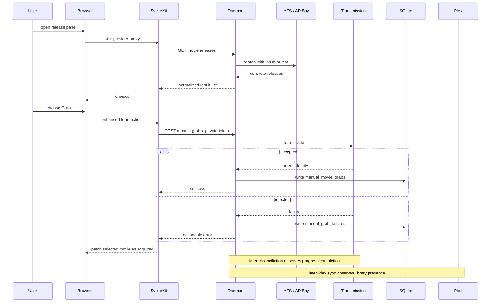

The fastest way to learn Pirate Claw is to follow one concrete act. Imagine opening Movie Discovery, finding a movie, choosing a YTS result, and tapping Grab.

## 1. The page arrives

The browser asks SvelteKit for the route. The shared layout concurrently asks the daemon for health, Transmission session, config, setup/readiness/install state, Plex auth, and security posture. The page load asks for the first movie-calendar chunk. SvelteKit renders HTML and serialized data; the browser hydrates the interactive components.

At this point nothing has contacted YTS for this movie. Calendar discovery and torrent lookup are deliberately separate.

## 2. The user asks for releases

Opening the grab panel triggers a browser-facing SvelteKit route. That server route calls the daemon. The daemon resolves the movie’s cached TMDB/IMDb identity and calls YTS; it may also call APIBay for text search. Provider errors and empty results should remain distinguishable.

## 3. The click crosses the trust boundary

The browser does not know the daemon write token. It submits an enhanced SvelteKit form action. The server validates fields and sends the daemon a bearer-authenticated request containing canonical TMDB identity, raw release title, provider, magnet, and best-effort quality/swarm metadata.

This is why the web process exists even in a local app: it owns human session security and private daemon credentials.

## 4. Transmission decides whether the request exists

The daemon asks Transmission to add the magnet. Only after Transmission accepts does Pirate Claw write a normal `manual_movie_grabs` row. If Transmission rejects or cannot be reached, Pirate Claw records a separate failure observation.

That ordering prevents an attempted click from appearing in the completed-acquisition history.

## 5. The UI updates before the world is finished

The action returns success and the Movie Discovery component patches local ownership state for the selected TMDB ID. The user does not need to wait for a Plex scan to see that the grab was accepted.

But the movie is not “in Plex” yet. Several truths now coexist:

- Pirate Claw: manual acquisition accepted.
- Transmission: live download state.
- Filesystem: incomplete or complete bytes later.
- Plex: unknown until scan and identity match.

The UI should represent those stages rather than collapse them into one checkmark.

## 6. Background observation closes the loop

Torrent polling keeps the Dashboard current. Reconciliation persists later Transmission observations. Plex synchronization eventually sees the library item through a provider GUID. The Movies archive can then combine acquisition history, TMDB description, release quality, and Plex evidence into one card.

No single request spans the whole journey. That is why durable IDs and observations matter.

## Where the design can fail

- Wrong TMDB match sends the wrong IMDb ID to YTS.
- Provider returns no structured quality or codec.
- Transmission accepts but later stalls.
- A season/movie file is complete but placed outside Plex’s library path.
- Plex scan is delayed or cache stale.
- Broad invalidation reruns unrelated shell/config work after the local patch.

Each failure belongs to a different boundary and should produce a different recovery action.

### In plain English

The Grab button does not teleport a movie into Plex. It creates a well-identified work order, gets a receipt from the downloader, and lets several later observers strengthen the evidence until Plex can point to the result.

### Key takeaway

Pirate Claw is an eventually consistent workflow. A responsive UI acknowledges the accepted step immediately while preserving the difference between queued, downloaded, and present in Plex.
