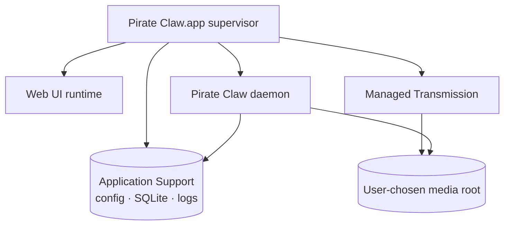

The current Mac runtime proves Pirate Claw works on target-class hardware. It is not yet the consumer product described by “download a DMG, drag Pirate Claw to Applications, and buy a license.” Packaging is a separate engineering project because the app must own processes, data, upgrades, recovery, and trust.

## Current versus productized Mac

| Concern | Current development/runtime | Paid Mac product |
|---|---|---|
| Installation | source checkout + Bun | signed/notarized `.app` in DMG |
| Daemon/web lifecycle | shell/launchd coordination | app supervisor with health/restart |
| Transmission | separately installed/configured | explicitly bundled or connected |
| Secrets/env | files and launch environment | Keychain/app support ownership |
| Media root | operator config | first-run choice, relocatable/external disk aware |
| Updates | git/deploy workflow | signed automatic updater |
| Diagnostics | logs/runbook | redacted export + reset/repair UI |
| Licensing | none | trial, entitlement, offline policy |

## Process topology comes first

Decide which process is the application supervisor. A native shell can launch the Bun daemon and web server, expose only loopback/private ports, monitor health, capture logs, and terminate children cleanly. If Transmission is bundled, the supervisor also owns its configuration, data directory, port, and upgrades.

Do not hide several unmanaged daemons behind a pretty window. Sleep/wake, login, crash loops, port conflicts, and app updates will expose the fiction.

The media root must survive moving the app and should support external disks. Application Support data should be backed up intentionally; large media should be excluded from Time Machine by policy/choice. Reset must distinguish preferences, database/history, downloader state, and downloaded files—never offer one ambiguous destructive button.

## Plex onboarding is product work

Same-machine Plex is a reasonable initial requirement. First run must authenticate, identify movie/TV libraries, select/create media directories, and ensure Plex scans the chosen paths. Programmatic Plex library creation/registration should not be promised until its supported API behavior is verified. A guided manual step is better than an unreliable private endpoint.

## Signing and notarization

Direct distribution outside the Mac App Store uses Developer ID signing and Apple notarization. Apple describes notarization as automated malware and code-signing checks—not App Review—and supports stapling the returned ticket to the app/DMG. See [Apple’s Developer ID overview](https://developer.apple.com/developer-id/) and [notarization documentation](https://developer.apple.com/documentation/security/notarizing-macos-software-before-distribution).

Every executable inside the bundle, including helper runtimes and Transmission, must be signed correctly under hardened runtime constraints. Test the actual downloaded DMG on clean supported macOS versions; a successful notarization upload is not a complete install test.

## Updates are a security boundary

A Sparkle-style updater is plausible for direct distribution, but update signing keys, feed hosting, rollback, migration compatibility, and interrupted installs are product infrastructure. Protect the signing key separately from ordinary deployment credentials. Database migrations need forward compatibility and backups because auto-update reaches users without an operator reading a runbook.

## Payment and entitlement

Payment should create an entitlement; it should not be embedded into the daemon’s acquisition logic. A pragmatic design is:

1. hosted checkout (for example Stripe);
2. webhook writes entitlement in a small service/database;
3. app activates with email/license link or code;
4. server returns a signed, expiring entitlement token;
5. app verifies locally and refreshes occasionally;
6. offline grace keeps local media functionality humane;
7. expiry disables premium acquisition/updates, never deletes data or media.

Supabase can hold customer/entitlement records, but payment provider webhook signatures remain authoritative for billing events. Avoid storing raw payment data.

## Recommended sequence

1. Freeze and ship reliable source/self-hosted v1.
2. Build a supervisor spike that survives reboot, sleep/wake, crashes, and port conflicts.
3. Decide bundled Transmission and media-root semantics.
4. Package/sign/notarize without payments.
5. Test upgrades and destructive boundaries.
6. Add redacted diagnostics and support flow.
7. Add trial/entitlement and checkout last.

This sequence prevents payment work from masking an install/runtime product that is not ready.

### In plain English

A DMG is not a zip file with a logo. A real Mac app must be the responsible adult for every helper process, secret, folder, update, failure, and uninstall decision. Billing comes after that adult can run the house safely.

### Key takeaway

Mac productization is its own roadmap. Process ownership, data safety, signing, upgrades, and diagnostics come before payment integration.
