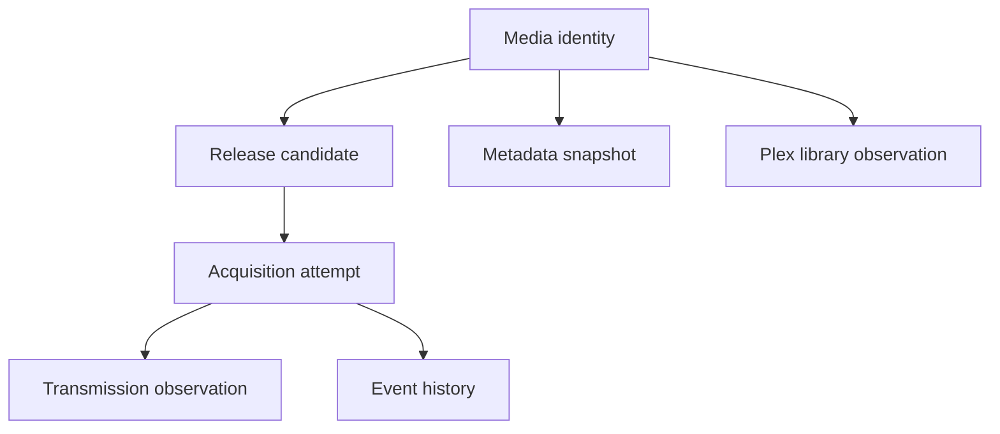

V1 is close to a shipping line. This page is a learning map for v2, not a backdoor request to disturb v1 before November 1.

## Keep these v1 instincts

- Local-first control and storage.
- Human review before consequential acquisition actions.
- Plex as practical library-presence authority.
- Separate “unknown” from “missing.”
- Durable history after a torrent leaves Transmission.
- File adoption as a recovery and recognition mechanism.

## A cleaner v2 core

The central difference is explicit concepts. A release is not an acquisition attempt. A metadata snapshot is not a Plex observation. A Plex observation is not a historical decision. V1 contains these ideas; v2 can model them more directly.

## Easy wins after v1

- Route-level request and payload telemetry on Mac.
- Resource-tagged mutation effects and narrower invalidation.
- Typed request and response schemas at the daemon boundary.
- Provider health and cache-freshness diagnostics.
- A clean no-TMDB degraded-mode experience.
- Backup, export, and diagnostics in the Mac app support bundle.

## Sticky work that can regress

- Identity migration across TMDB, IMDb, and TVDB.
- Merging manual and RSS ledgers.
- Season-pack and file-adoption semantics.
- Plex reconciliation rules.
- Replacing the manual dispatcher with a framework in one big move.
- Licensing, entitlements, and offline activation.

## The v2 question worth asking

Not “what can be rewritten?” Ask: **what would make the next operator question easier to answer without sacrificing the careful behavior v1 already earned?**

## Key takeaway

The best v2 is not a shinier dashboard. It is a system whose truths, contracts, events, and failure modes are easier to see and safer to change.
