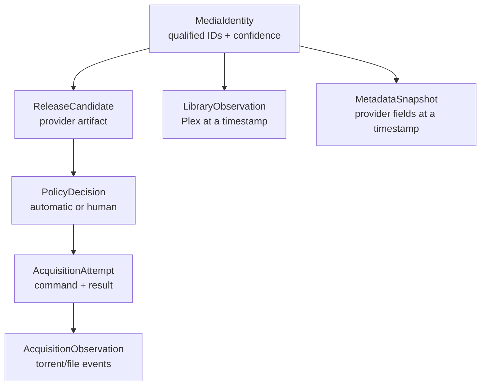

A greenfield redesign should not begin by replacing Svelte, Bun, or SQLite. Those technologies are not the central source of complexity. Start by naming the domain concepts v1 discovered the hard way.

## Keep the product instincts

- Local-first storage and control.
- Human review at ambiguous or destructive decisions.
- Plex as the initial library witness.
- `unknown` distinct from `missing`.
- Durable history after downloader state disappears.
- Recovery/adoption as a first-class path.
- Automatic policy and explicit manual selection as different provenance.
- Conservative handling of uncertain files and identity.

Any redesign that loses those in pursuit of elegance is worse.

## The v2 domain spine

A release is not a movie. A decision is not an attempt. An accepted attempt is not completion. Completion is not Plex ownership. A metadata description is not library state. Making those nouns explicit removes much of today’s accidental coupling.

## Append events, project views

Keep current-state tables for fast UI, but append durable events for consequential transitions:

- release discovered;
- policy accepted/rejected;
- user chose release;
- Transmission accepted/rejected;
- torrent observation changed;
- files adopted;
- Plex confirmed/lost presence;
- user deleted/untracked;
- identity pinned/rejected.

Projection code can build Dashboard, Movies archive, show-season status, and support timelines. This is not an argument for distributed event infrastructure. SQLite transactions and an append-only event table are enough for a single-Mac product.

## Resource-shaped API

Use Hono or a similar framework to expose validated resource groups:

- `/media-identities`
- `/releases`
- `/acquisitions`
- `/torrents`
- `/library-observations`
- `/tracked-shows`
- `/jobs`
- `/providers`

Mutations return semantic effects and correlation IDs. Long work becomes a daemon job with progress instead of a browser-owned stream. The UI can invalidate resource keys precisely or subscribe to a local event stream for high-volatility torrents.

## Provider-neutral but capability-aware

Adapters should declare identity requirements, supported media types, search modes, quality fields, health, retry policy, and licensing configuration. Metadata identity and artwork should be separate capabilities. TMDB remains one adapter during migration; TheTVDB and Fanart can be introduced without erasing TMDB history.

## Application boundary

The Mac `.app` owns child processes, secrets, ports, data directories, logs, updates, and reset. The web UI remains useful as the presentation layer, potentially hosted in a native web view or local browser, but users interact with one supervised application.

## A safe sequence

1. Ship and observe v1.
2. Create qualified identity and event tables additively.
3. Emit events alongside existing writes; compare projections.
4. Introduce Hono beside the dispatcher and migrate reads.
5. Add provider contracts and one secondary metadata capability.
6. Move long browser workflows into durable jobs.
7. Build the Mac supervisor and packaging track.
8. Migrate screens gradually; preserve export/rollback.

No step requires a flag-day database rewrite.

## Tricky areas that deserve prototypes

- migration of same-title/pinned identities;
- season packs mapping one attempt to many episodes;
- deleting files versus retaining history;
- Plex disappearance after prior confirmation;
- external disk unavailable versus media deleted;
- offline entitlement without punishing legitimate owners;
- metadata removal/caching obligations;
- updater rollback across schema migration.

## The north-star support question

For any movie or episode, v2 should answer in one screen:

> How did we identify it, where did the release come from, who or what chose it, what did Transmission do, what files appeared, what does Plex currently see, and how fresh is each answer?

If the architecture makes that sentence easy, it is cleaner in a way users and maintainers can feel.

### In plain English

V2 should turn today’s separate receipts into one honest timeline without pretending every receipt is the same kind. It should also put all the helper machinery under one Mac app that knows how to start, update, repair, and explain itself.

### Key takeaway

Redesign around identity, releases, decisions, observations, and effects—not around frameworks. Preserve v1’s judgment while making causality visible.
