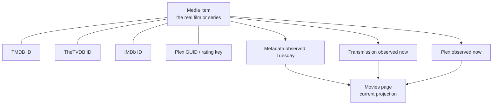
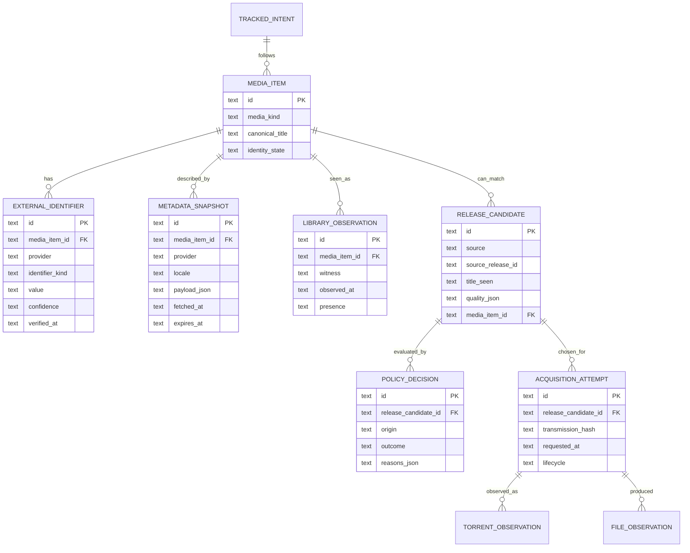
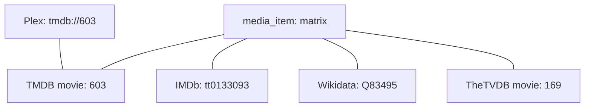
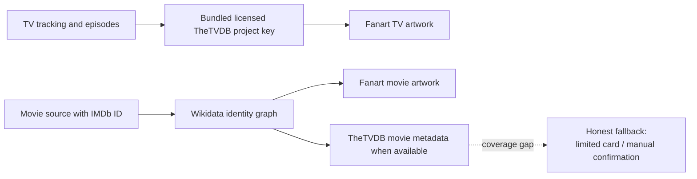
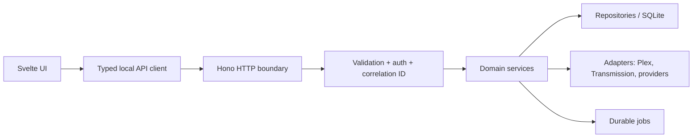
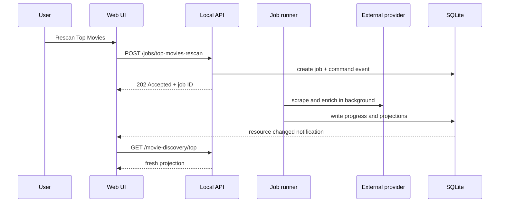
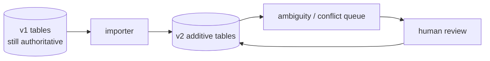

This is the long version of **If We Started Fresh**. That page gives the answer. This one teaches the vocabulary and reasoning needed to judge whether the answer is any good.

It is deliberately not a v1 implementation plan. Pirate Claw v1 has a ship line, a working Mac and NAS deployment, and a product deadline. A rewrite started because the word “architecture” sounds exciting is how a healthy product loses six months. The point of this chapter is to make the v2 shape legible now, so future work is chosen calmly and v1 can be improved without accidentally becoming a half-rewrite.

The provider findings below are a point-in-time technical investigation made on 20 September 2026. They are engineering evidence, not legal advice or a commercial license. Before charging customers, confirm the applicable provider terms in writing.

## Start with the mental model: Pirate Claw is a local evidence machine

It is tempting to describe Pirate Claw as “an app that downloads movies and TV.” That is true in the same way that a bank is “an app that moves money.” It misses the hard part.

Pirate Claw is really a local system that collects and reconciles evidence about media:

- a feed says a release was seen;
- a metadata catalog says what that release might refer to;
- a policy or person says whether to pursue it;
- Transmission says whether it accepted and completed the work;
- the filesystem says what files appeared;
- Plex says whether a library item is actually present and playable.

Those sources are not equally reliable, and they do not answer the same question. That is why a download can complete while Pirate Claw still should not say “owned,” or why a title can look right in a search result while actually being the wrong show.

```mermaid
flowchart LR
  F[Feed or manual search<br/>"A release exists"]
  M[Metadata provider<br/>"This is probably The Example Film"]
  D[Decision<br/>"We chose to acquire it"]
  T[Transmission<br/>"The bytes completed"]
  FS[Filesystem<br/>"These files appeared"]
  P[Plex<br/>"This library item exists now"]

  F --> D
  M --> D
  D --> T
  T --> FS
  FS --> P
```

Notice what this diagram does **not** say: it does not make any one box the permanent ruler of everything. Plex is the strongest witness for local ownership. Transmission is the strongest witness for a torrent’s runtime state. A provider is useful for editorial facts such as an overview or a release date. They are different jobs.

### In plain English

Think of Pirate Claw as a careful clerk with a stack of receipts. A receipt from Transmission proves that a shipment arrived at the warehouse. It does not prove that it was shelved in the store. Plex is the person walking the shelves. A metadata provider is the catalog card telling us what the item is supposed to be.

### Key takeaway

V2 should preserve separate evidence instead of flattening everything into a single optimistic status field.

## The small vocabulary that makes system design less mystical

System-design conversations get muddy when one word does five jobs. These are the terms that matter for Pirate Claw.

### Entity, identifier, observation, and projection

An **entity** is the real-world thing we are talking about: the film *The Matrix*, a particular TV series, a specific torrent, or a tracked show rule.

An **identifier** is a label issued by somebody else: `tmdb:603`, `thetvdb:169`, `imdb:tt0133093`, a Plex rating key, or a Transmission hash. An identifier is not the entity. It is an address in another organization’s address book.

An **observation** is a time-stamped claim: “Plex listed this movie at 14:05,” “Transmission reported 100%,” or “TheTVDB said the next episode airs on this date.” Observations go stale. That is normal.

A **projection** is a convenient current view made from stored facts and observations. The Movies page, a show’s “missing episodes” grid, and a dashboard count are projections. They should be cheap to read, but never treated as the original evidence.



### In plain English

The movie is the person. Its TMDB, IMDb, TheTVDB, and Plex numbers are different phone-book entries for that person. A page in the app is a whiteboard summary of the latest calls we made. If one phone book gets changed or disappears, the person did not disappear.

### Key takeaway

Do not make a provider ID the primary identity of Pirate Claw’s own data model.

## Why v1 feels more tangled than it deserves to

V1 earned its complexity honestly. It began with RSS and policy, then gained metadata, Plex reconciliation, manual acquisition, discovery, file selection, archived movies, and safe identity correction. Each feature made a local, sensible choice.

The accumulated issue is that a TMDB ID now plays several roles at once:

- metadata lookup key;
- user-visible route/deep-link key;
- persistent movie ledger key;
- manually pinned TV identity;
- IMDb crosswalk source for YTS and EZTV;
- Plex GUID comparison target;
- cache key and image URL source.

That is a form of **coupling**: one thing changes and many unrelated responsibilities move with it. TMDB is not merely an API client tucked behind a utility file. It is part of the app’s identity model.

This does not mean v1 is “bad.” It means the system learned that identity is more central than the first design expected.

### Example: the wrong-but-plausible show

Suppose someone tracks a show with a short or reused title. A search provider may return a more popular title first. The poster, overview, season count, and episode grid can all be internally consistent—but for the wrong show. That is worse than a visible error because it looks trustworthy.

V1 already protects against this through explicit TMDB pins, rejections, and operator confirmation. V2 should preserve the *judgment* while changing the storage shape:

```text
Bad mental model:
  title string → provider search → first result → truth

Better mental model:
  tracked intent → candidate identities → confidence/evidence →
  operator confirmation when required → durable accepted identity
```

### In plain English

Today, TMDB is both the librarian, the filing cabinet label, and one of the locks on the front door. That was convenient while the app was growing. In v2, it should become one respected librarian among several, while Pirate Claw keeps its own filing system.

### Key takeaway

V2 is not “replace TMDB.” It is “stop letting any outside catalog be Pirate Claw’s only filing system.”

## The v2 mental model: a journal plus fast views

There are two broadly useful ways to store application state.

The first is a mutable record: update a row until it says what is true now. This is simple and fast. V1 uses this successfully in many places.

The second is an append-only journal: record meaningful changes, then build current views from them. This is often called **event sourcing**. The phrase can sound like a demand for Kafka, microservices, and heroic suffering. It is not. For a local Mac app, it can mean one SQLite table called `domain_events` and a few carefully chosen projectors.

The sensible v2 design is a hybrid:

- append events for consequential history;
- retain current-state tables for fast screen reads;
- use a transaction to write the event and update the current view together.

```mermaid
flowchart LR
  C[Command<br/>"Grab this release"] --> H[Domain handler]
  H --> E[(domain_events<br/>durable journal)]
  H --> P[(current-state projections<br/>fast reads)]
  P --> UI[Dashboard / Movies / Shows]
  E --> S[Support timeline<br/>audit / rebuild / diagnosis]
```

An event is not a noisy log line. It has a domain meaning:

- `release.discovered`
- `acquisition.requested`
- `acquisition.accepted_by_transmission`
- `torrent.completed`
- `files.observed`
- `library.confirmed_by_plex`
- `media.identity_pinned`
- `movie.deleted_from_disk`

An ordinary debug log may say “HTTP request took 342 ms.” Useful, but it should not decide the Movies page. An event says “the user asked to grab this release, and this is the resulting durable state change.”

### A concrete scenario

Someone selects a season pack, removes three unwanted files, and asks Pirate Claw to proceed.

1. The UI sends a command with the selected file set.
2. The daemon records `acquisition.requested` with the intent and the selection.
3. Transmission accepts the torrent; record its hash.
4. Reconciliation later observes completion and file paths.
5. Plex eventually sees individual episodes.
6. The show projection computes “complete,” “missing,” or “unknown” from evidence—not from wishful thinking.

If the app is restarted between steps 3 and 4, the journal tells it what was already requested. The operation can be idempotent: repeating the same command does not create a second torrent.

**Idempotent** means “safe to repeat.” It is one of the most valuable boring words in software. Network requests fail in ways that leave you unsure whether the server accepted them. A safe system records a client command ID, recognizes a retry, and returns the first result instead of doing the irreversible thing twice.

### In plain English

Keep the receipt and the current scoreboard. The receipt explains how we got here. The scoreboard makes the app quick. You need both.

### Key takeaway

V2 should add a durable story of important changes without making every button wait for a distributed-systems seminar.

## The proposed v2 domain model

The center of v2 is not “movies,” “shows,” or “torrent rows.” It is a small set of nouns that can be combined honestly.



### What each table means

**`media_item`** is Pirate Claw’s own stable record for one film or one series. It is intentionally boring. It does not promise that the title is final forever; it says there is one internal object that providers can point at.

**`external_identifier`** stores provider-specific addresses. The important uniqueness rule is not “one TMDB ID per row.” It is `(provider, identifier_kind, value)`. A media item may have TMDB, TheTVDB, IMDb, Wikidata, and Plex identifiers at the same time.

**`metadata_snapshot`** stores what a provider said, when it said it, in which language, and how long that answer can be treated as fresh. It makes source and freshness visible instead of smearing provider fields across a dozen unrelated tables.

**`release_candidate`** is the thing a feed, YTS, EZTV, or a torrent search produced. It might not map to an identity yet. That is a feature: uncertainty is data.

**`policy_decision`** records why a release was accepted, rejected, or held: automatic rules, a manual click, an excluded file, missing codec evidence, or an identity problem.

**`acquisition_attempt`** records the request made to the downloader. It has its own lifecycle because “we asked Transmission” and “the media is now in Plex” are not one state change.

**`library_observation`** is an observation from Plex or, cautiously, the filesystem. It is how the app can say “Plex saw it at this time” rather than “we hope it is owned.”

### In plain English

This is a set of index cards. One card is the movie itself. Other cards attach outside IDs, provider descriptions, torrents we noticed, choices we made, download attempts, and Plex sightings. Nothing has to pretend it is the same kind of card.

### Key takeaway

The schema should record relationships and provenance. It should not force every fact into a giant “movie row.”

## Identity needs a graph, not a conversion function

An **identity graph** is simply the network of identifiers that refer to the same thing, plus evidence explaining why Pirate Claw believes the link.



The links need their own evidence levels:

| Evidence | Example | Migration treatment |
|---|---|---|
| Authoritative external-ID agreement | TheTVDB extended record explicitly lists the same TMDB ID | Safe automatic link |
| Plex GUID agreement | Plex returns `tmdb://603` and Pirate Claw already has TMDB 603 | Safe automatic link |
| Exact title plus exact year | Same title and release year from two sources | Tentative; review if consequential |
| Title-only match | Two titles normalize to the same string | Never silently promote |
| Human selection | User reviewed candidates and chose one | Durable confirmed link |

This is where the current manual pin/rejection work becomes an asset. It taught the exact rule v2 needs: a wrong match is not a minor display blemish. It can send a search to the wrong show, make the wrong season look missing, and corrupt future automated decisions.

### In plain English

Do not build a machine that says “TMDB 603 converts to TheTVDB 169.” Build a record that says, “These two numbers point to the same movie because the providers themselves agreed, and we checked on this date.”

### Key takeaway

Keep confidence and proof next to every cross-provider identity link.

## Provider adapters: capability-aware, not provider-obsessed

An adapter is a small translation layer between Pirate Claw and an outside service. A good adapter does not leak the outside service’s vocabulary through the entire app.

This is sometimes called an **anti-corruption layer**. The dramatic name just means: do not let a vendor’s data model infect every internal decision.

Instead of asking “is this the TMDB client?”, v2 asks “can this provider perform this capability?”

```ts
type ProviderCapabilities = {
  mediaKinds: ('movie' | 'series' | 'episode')[];
  search: 'none' | 'text' | 'external-id';
  supplies: {
    identity: boolean;
    overview: boolean;
    artwork: boolean;
    ratings: boolean;
    releaseCalendar: boolean;
    episodeSchedule: boolean;
    imdbCrosswalk: boolean;
  };
  commercial: {
    attributionRequired: boolean;
    cachePolicy: 'unknown' | 'bounded' | 'allowed';
    embeddedKey: 'unknown' | 'allowed' | 'not-allowed';
  };
};
```

The code above is a design sketch, not v1 code to paste. Its value is that a screen can ask for a capability and show an honest fallback. The Movie Calendar should not quietly call a provider that lacks date-range release discovery and then pretend the results are equivalent.

### The provider evidence, not the marketing pitch

Here is what the live investigation found.

| Provider | What the real test supports | What it does not support |
|---|---|---|
| TheTVDB | Strong TV metadata, episodes, language, lifecycle, IMDb aliases, artwork; a configured v4 key authenticated | Full movie replacement, TMDB-style ratings, equivalent movie calendar/discovery |
| Wikidata | Public CC0 factual graph; direct REST entity reads; excellent IMDb → TMDB mapping for a popular NAS Top Movies sample | Editorial synopsis, vote counts, purpose-built media search, calendar semantics, artwork delivery |
| Fanart.tv | Configured key returned rich movie/TV/season artwork; 30/30 sampled NAS Top Movies had posters and 28/30 had backdrops | Identity resolution, title search, overview, ratings, release dates |
| OMDb | IMDb-oriented lookup shape exists | Current configured key returned invalid; public terms/licensing are not a safe commercial foundation |

#### TheTVDB: a serious TV candidate

The configured TheTVDB key successfully authenticated against v4. A current NAS sample of 30 positive TMDB TV cache records produced:

- 29 records with a series candidate from direct remote-ID lookup;
- 26 exact TMDB crosswalk matches after verifying the returned extended record;
- overview and primary image on all 25 title-matched extended records tested;
- a currently airing mapped show with overview, image, status, next/last-air fields, IMDb alias, seasons, and episode overviews.

That is good enough to treat TheTVDB as a serious **TV metadata** candidate. It is not good enough to blindly translate every existing TV row. Four of the 30 tested identities still needed a review or fallback path.

Its public pricing currently describes an under-$50,000 annual-revenue tier as free with required attribution. That is much clearer than a user-supplied TMDB developer key for a paid product, but it is still not a substitute for written confirmation about embedding a project key in a paid Mac app, caching, artwork, and key rotation. See [TheTVDB API and data licensing](https://thetvdb.com/api-information).

#### Wikidata: an ID graph and factual fallback

Wikidata is not a movie database in the user-experience sense. It is a giant, community-maintained graph of claims. Its main structured data is CC0, and normal read access needs no username or password. The configured credentials are therefore not needed for ordinary metadata reads; do not treat a stored password as a runtime prerequisite.

For the NAS’s cached Top Movies data, 30 evenly spaced IMDb IDs were queried through a narrow Wikidata query. All 30 resolved to both a Wikidata item and a TMDB movie ID. That is an encouraging route for known, mainstream IMDb identities:

```text
IMDb ID → Wikidata item → TMDB numeric alias → Fanart artwork
```

It is not a universal promise. Wikidata’s own guidance says to use direct entity reads for known items, narrow queries for well-scoped relationships, and not to use the REST API as a large unfocused data source. It also asks clients to cache responsibly and back off on `429`s. See [Wikidata data access](https://www.wikidata.org/wiki/Wikidata:Data_access).

Wikidata can provide labels, descriptions, external IDs, language, genres, release-date claims, and Commons image references. But those are claims with qualifiers, multiple regional release dates, uneven completeness, and sometimes competing values. It is a superb **corroborating ledger**, not a turnkey home-screen catalog.

#### Fanart.tv: beautiful, useful, and deliberately narrow

Fanart worked technically with the configured key. Its movie endpoint accepts a TMDB movie ID; its TV endpoint accepts a TheTVDB series ID. For a representative known movie it returned posters, backgrounds, logos, discs, banners, and thumbnails. For a TV series it returned show, season, logo, clear-art, and character-art families.

That makes Fanart an excellent artwork adapter after identity is known. It does not search for a movie, decide which title is correct, or provide the synopsis/rating/release facts the current cards show.

The site offers commercial sponsorship options, but that page is not a full redistribution or caching agreement. Get written clarity before relying on its artwork in a paid DMG. See [Fanart API sponsorship](https://fanart.tv/sponsors/).

#### OMDb: not the commercial escape hatch

OMDb has a pleasant-looking IMDb-based API, but the configured key returned `401 Invalid API key` during the investigation. More importantly, OMDb’s public key page describes content as CC BY-NC 4.0, and its terms forbid building a business using its contributions. A free daily request allowance is not a commercial license. See [OMDb API](https://www.omdbapi.com/), [API key information](https://omdbapi.com/apikey.aspx), and [OMDb terms](https://www.omdbapi.com/legal.htm).

### In plain English

Providers are specialists. TheTVDB can be the TV encyclopedia. Wikidata can be the index of names and cross-references. Fanart can be the art department. OMDb is not safe to bring into a paid shop without a new agreement. None of those specialists magically becomes the whole movie department.

### Key takeaway

Make providers plug into explicit capabilities. A combination can reduce TMDB dependence, but a combination is not automatically a replacement.

## Could this remove TMDB BYOK for customers?

**For TV, plausibly. For the entire v1 product, not yet.**

The strongest no-customer-key path is:



This can eliminate a direct TMDB API call in several valuable paths. It cannot honestly reproduce the whole current movie experience because the combination still lacks a commercially cleared, consistently covered source for all of these at once:

- free-text movie discovery;
- rich overview text;
- user-facing ratings and vote counts;
- popularity-ranked calendars;
- trustworthy digital/physical availability dates;
- broad movie coverage outside well-known IMDb-linked titles.

There is an important subtlety here. Retaining a stored `tmdb:movie:603` identifier as an alias is not the same thing as calling TMDB’s API. Technically, Wikidata may supply that numeric alias and Fanart may consume it for artwork. Legally, the product still needs a review of relevant provider and artwork terms. Architecture can remove a technical dependency; it cannot manufacture a license.

### A good product promise versus a dangerous promise

Good, supportable promise for a future TV-first product:

> Install Plex and Pirate Claw. Pirate Claw brings its own licensed TV metadata service and tells you when a result needs your confirmation.

Dangerous promise today:

> Pirate Claw needs only Plex and has all the same movie intelligence as TMDB.

The second promise is not supported by the provider evidence.

### In plain English

We can probably take the TVDB key chore away from a customer sooner than we can take the movie-database problem away. Do not tell customers they only need Plex until movie search, descriptions, dates, and ratings have an honest replacement.

### Key takeaway

The commercial win is “fewer customer prerequisites,” not “pretend every provider has the same data.”

## The API boundary: why Hono helps, and what it does not solve

V1’s daemon API has grown through a large manual route dispatcher. It works, but every new route has to remember validation, authentication, response shape, errors, logging, correlation IDs, and what the web UI should invalidate afterward.

Hono is a small TypeScript web framework. It would not make the domain logic wiser. It would make the HTTP edge more disciplined:

- group resource routes in one place;
- validate request and response shapes at the boundary;
- centralize write authorization;
- attach a request/correlation ID;
- generate or share typed client contracts;
- make resource-level cache invalidation possible.



The key design rule is that Hono should be a boundary, not a second business layer. A `GrabRelease` domain service should be callable from an HTTP route, a future CLI repair command, or a background job without knowing which one invoked it.

This is sometimes described as **hexagonal architecture** or **ports and adapters**:

- the core defines the work it needs done: “look up a series by external ID,” “submit a torrent,” “observe Plex”; 
- adapters implement those needs for TheTVDB, Transmission, Plex, or a test fake;
- the core does not import the vendor SDK everywhere.

### In plain English

Hono is the front desk. It checks who is asking, makes sure the form is filled out correctly, gives the request a tracking number, and hands it to the actual workers. It should not become the warehouse manager.

### Key takeaway

Use a framework to make the HTTP boundary boring and typed. Keep acquisition and identity rules in framework-independent services.

## Jobs, commands, and live updates

The browser is a poor owner of long-running work. A tab can close, the iPad can sleep, a network request can time out, and a streaming response can be lost while the daemon keeps working.

V2 should distinguish:

- a **command**: “rescan this year,” “refresh metadata,” “grab this release”;
- a **job**: durable daemon-owned work that can take time;
- an **effect**: the state change the job eventually produced;
- a **notification**: a small event telling the UI that a resource changed.



This lets the UI invalidate a precise resource key such as `movie-discovery:top:2026` instead of throwing `invalidateAll()` at the whole application. `invalidateAll()` is not morally wrong; it is simply a blunt instrument. It causes unrelated page loaders, layout work, and expensive provider reads to wake up together.

### In plain English

The button should place a work order, not personally carry boxes across town. The page gets a receipt immediately, then refreshes only the shelf that changed.

### Key takeaway

Move durable work into daemon jobs and make UI refreshes resource-specific.

## The v1-to-v2 migration: add, compare, then switch

A safe migration is not a weekend SQL rewrite. The non-negotiable rule is: **do not throw away proven v1 identity or history to make the new schema look clean.**

The NAS snapshot used in provider evaluation had 152 identified positive TV metadata-cache rows, 172 identified positive movie-cache rows, and 122 tracked-show records. Those counts will change. Their purpose is to show that migration is real data work, not a blank-database thought experiment.

### Phase 0: inventory the current truth

Before schema changes, produce a read-only inventory of:

- every persisted TMDB ID;
- pins, rejections, manual-grab rows, candidate rows, and cached metadata;
- Plex GUIDs and IMDb IDs already observed;
- all places the web uses a TMDB ID as a route or form parameter;
- cache rows with missing/negative/stale metadata;
- unmatched historical data that deserves a review queue.

The inventory is the migration’s control group. Without it, a “successful” migration can quietly lose the awkward records that taught v1 its best lessons.

### Phase 1: introduce v2 tables additively

Create `media_item`, `external_identifier`, `metadata_snapshot`, and `domain_events` alongside current tables. Do not rename `tmdb_id` columns. Do not change what existing routes return.

For every confidently identified v1 movie/show, create a `media_item` and attach the TMDB ID as an external identifier. Import Plex GUID and IMDb aliases where already known. Stamp every link with its evidence source.



### Phase 2: backfill providers without letting them rewrite history

Run TheTVDB and Wikidata crosswalks in a durable job. Each result can become one of four outcomes:

| Outcome | Example | What v2 does |
|---|---|---|
| Verified | Provider explicitly returns matching TMDB and IMDb IDs | Add verified alias automatically |
| Plausible | Exact title/year but no independent ID proof | Mark tentative; do not switch operational behavior |
| Ambiguous | Two plausible series share a title | Ask for review; retain v1 identity |
| Missing | Provider has no record | Preserve v1 identity; retry only under a sensible policy |

This is where the current explicit pin and rejection rules remain valuable. A human-confirmed v1 pin should outrank an automated name match. A provider failure should never turn a known media item into “unknown.”

### Phase 3: dual-write and shadow-read

For a period, v1 remains the source of operational truth while v2 records parallel events and projections.

- Feed intake writes its v1 candidate state and a v2 release event.
- A manual grab uses existing Transmission behavior and also records a v2 acquisition attempt.
- Plex reconciliation writes current v1 cache state and a v2 library observation.
- Read-only diagnostic pages compare v1 and v2 explanations without changing user decisions.

This is **shadow mode**: the new system watches and calculates, but does not get the steering wheel. It lets us measure whether the proposed model handles season packs, deleted movies, missing disks, and provider failures before a customer depends on it.

### Phase 4: migrate one capability at a time

Good first candidates:

1. provider-neutral artwork snapshots;
2. provider identity audit screen;
3. metadata freshness/provenance display;
4. job-based Top Movies rescan;
5. one TV detail read path;
6. only later, acquisition mutation paths.

Bad first candidates:

- replacing every movie ID;
- changing the ownership definition;
- rewriting the season-completeness algorithm while changing providers;
- moving the daemon and UI framework in the same release;
- deleting v1 tables because the new schema is prettier.

### Phase 5: preserve aliases indefinitely

Plex often exposes TMDB GUIDs. Old web deep links, old event history, user pins, and support evidence may also contain TMDB IDs. V2 can stop depending on TMDB’s API without deleting TMDB identifiers from its own history.

An alias can be inactive as a lookup provider yet remain essential evidence. That is a mature migration outcome, not unfinished cleanup.

### In plain English

Move house room by room. Keep the old address book until every important contact has been checked. Put uncertain boxes in a clearly labeled review pile instead of throwing them away because they make the new closet look messy.

### Key takeaway

Add v2 beside v1, compare it against live behavior, and switch one capability at a time. Never make a provider migration and a product rewrite the same bet.

## A practical v1 versus v2 boundary

The v1 goal is not to solve every architectural desire before November 1. It is to ship a reliable, understandable product for the M-series Mac mini customer.

### Worth doing in v1 if the product work calls for it

- A read-only provider audit that reports crosswalk confidence and missing coverage.
- Required attribution and a commercial-terms checklist.
- Better logs around provider latency, provider response class, cache hit/miss, and fallback selection.
- Preserve last-known-good metadata when an optional provider fails.
- Small data-model additions that retain source and fetch time.
- A clear UI explanation when metadata is unavailable versus when Plex ownership is unknown.

### Keep for v2 unless a real v1 bug forces it

- Replacing the dispatcher with Hono.
- Full event journal and projection system.
- Provider-neutral identity as the primary key everywhere.
- A daemon-supervising native Mac shell.
- A no-BYOK promise for all movie flows.
- Replacing movie calendar/rating behavior without a commercially cleared equivalent.

### In plain English

V1 should get stronger guardrails and better receipts. V2 is where we rebuild the roads. Do not pave a new highway through a house that still needs to open for business.

### Key takeaway

The best v1 architecture work creates evidence and seams that make a later rewrite safer; it does not disguise a rewrite as a bugfix.

## The one-screen support test

The proposed system should make one support question easy to answer for any movie, show, season, or release:

> What is this item, which identifiers support that answer, which provider last described it, how was this release found, who or what chose it, what did Transmission report, what files were observed, what does Plex see now, and how fresh is every claim?

If the answer needs a scavenger hunt through logs, caches, config, and three inconsistent pages, the model is still hiding causal truth.

If the answer is an evidence timeline with links to the relevant observations, the system has become easier to operate—not merely more fashionable.

### Final plain-English summary

V2 should be a better memory for Pirate Claw. It remembers the movie separately from its many outside IDs. It remembers a torrent separately from the decision to grab it. It remembers what Plex actually saw separately from what a download client claimed. It lets TheTVDB, Wikidata, Fanart, and any future provider contribute their specialty without one of them secretly becoming the whole app.

### Final takeaway

Build v2 around qualified identity, durable evidence, capability-aware providers, daemon-owned jobs, and additive migration. That is how Pirate Claw can become a polished Mac product without losing the hard-won caution that makes v1 trustworthy.
